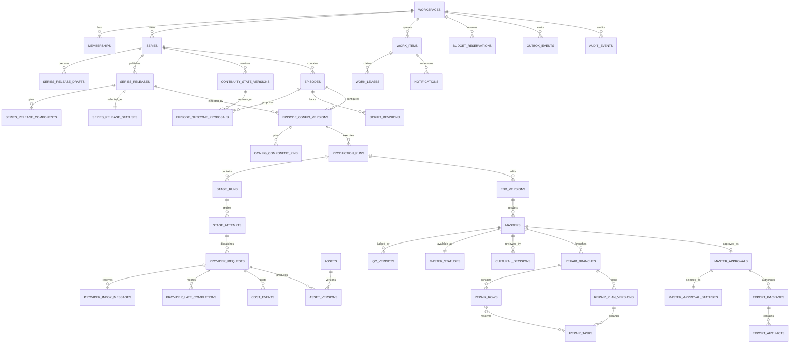

# Genie State and Data Contract

**Status:** Normative implementation contract  
**Version:** 1.0  
**Last updated:** 2026-07-17  
**Applies to:** Supabase Postgres/Auth/Storage/Realtime, Trigger.dev workflows,
provider adapters, ffmpeg workers, and the Genie web application  
**Parent contract:** `docs/design.md`

## 1. Purpose and normative language

This document turns the product state model into implementable database,
workflow, concurrency, and recovery rules. It is intentionally stricter than a
UI state diagram. A client label, workflow log, or provider status is never
authoritative unless it has been committed through the transitions defined
here.

The words **MUST**, **MUST NOT**, **SHOULD**, and **MAY** are normative.

Core rules:

1. Stable identities and immutable versions are separate records.
2. Media-producing foreign keys pin exact versions, never an unversioned
   "current" record.
3. State changes occur through allowlisted commands with an expected aggregate
   version. Direct client updates to state columns are prohibited.
4. Side effects are requested through a transactional outbox. A database
   commit never assumes that a network call succeeded.
5. External completions are accepted through an idempotent inbox. Duplicate or
   late callbacks may be recorded, but cannot make a stale output
   authoritative.
6. A user-visible action is authorized again at commit time. A valid page load,
   old JWT, earlier lease, or previous role is not continuing authority.
7. Every expensive provider request reserves budget and capacity before
   enqueue.
8. Terminal records are not reopened. Recovery creates a new attempt, run,
   branch, package, or version.
9. All timestamps use UTC `timestamptz`; media time uses integer milliseconds
   from the narration master clock.
10. UUID primary keys use server-generated values. Human-readable numbers are
    scoped and independently unique.

## 2. State ownership

| Concern | Authoritative owner | Not authoritative |
|---|---|---|
| Episode lifecycle | Postgres `episodes.workflow_state` committed by command | Browser route, progress animation |
| Configuration content | Immutable `episode_config_versions` | Mutable form after activation |
| Series inheritance | Immutable `series_releases` and component pins | "Latest asset" lookup |
| Workflow execution | `production_runs`, `stage_attempts`, Trigger.dev execution ID | Trigger.dev log alone |
| Provider completion | Inbox-verified `provider_requests` plus committed asset | Provider dashboard/CDN URL |
| Review assignment | `work_items` plus current fenced lease | Notification read state |
| Repair | `repair_branches`, plan version, task graph | Raw Monica chat transcript |
| Final approval | Immutable `master_approvals` bound to master/QC versions | Episode-level boolean |
| Export | `export_packages` and immutable artifact manifest | A mutable download URL |
| Spend | Reservation and append-only cost ledger | Provider estimate or UI total |
| Diagnostics/audit | Append-only Postgres records | Console output |

Health, attention, and freshness are orthogonal projections. They MUST NOT be
folded into the workflow-state column:

- `health_state`: `healthy | delayed | retrying | provider_failed |
  quality_blocked | budget_blocked | stale_dependency | canceled`
- `attention_state`: `none | needs_me | needs_team | waiting_on_system |
  watching`
- `freshness_state`: `current | series_update_available | stale | superseded`

These projections may be materialized for query performance, but MUST be
recomputable from authoritative records and updated transactionally with the
event that changed them.

## 3. Command envelope and transition protocol

Every state-changing command uses this logical envelope:

```ts
type CommandEnvelope<T> = {
  commandId: string;             // UUID, globally unique
  commandType: string;           // allowlisted command name
  workspaceId: string;
  aggregateType: string;
  aggregateId: string;
  expectedVersion: number;
  actor:
    | { kind: "user"; userId: string; sessionId: string; aal: "aal1" | "aal2" }
    | { kind: "workflow"; runId: string; executionId: string }
    | { kind: "system"; principal: string };
  lease?: { leaseId: string; fencingToken: number };
  idempotencyKey: string;
  correlationId: string;
  causationId?: string;
  payload: T;
};
```

The database command handler MUST, in one transaction:

1. authenticate the actor and load current membership/permission;
2. check workspace and aggregate scope;
3. return the previously committed result for an existing `command_id` or
   idempotency key;
4. lock or compare the aggregate row;
5. require `aggregate_version = expected_version`;
6. verify the allowlisted transition and all business preconditions;
7. verify a supplied lease and fencing token where required;
8. apply the state change and increment `aggregate_version`;
9. append audit and domain events;
10. insert intended external work into the outbox;
11. commit before any network side effect.

Conflict response:

```json
{
  "code": "VERSION_CONFLICT",
  "expectedVersion": 14,
  "currentVersion": 16,
  "currentState": "pending_qualified_review",
  "conflictingEventIds": ["..."]
}
```

The client MUST refresh and offer compare, merge, discard, or fork. It MUST NOT
retry a semantically non-commutative command with a new expected version
without user or workflow re-evaluation.

## 4. State machines

### 4.1 Episode

States:

```text
draft -> world_setup -> ready_to_produce -> pending_qualified_review
  -> awaiting_final_review -> approved -> delivered
pending_qualified_review|awaiting_final_review|approved|delivered
  -> pending_qualified_review
  (only through repaired-candidate promotion)
```

`archived` is reversible from quiescent states. `abandoned` is terminal for the
Episode identity; a restart creates a new Episode or explicit fork.

| Command | From → To | Actor | Preconditions | Atomic effects/events | Recovery |
|---|---|---|---|---|---|
| `episode.create` | none → `draft` | member+ | Active membership; Series accepts Episodes; unique episode number in Series | Create Episode, creator/owner, initial work item; `episode.created` | Same idempotency key returns same Episode |
| `episode.begin_world_setup` | `draft` → `world_setup` | owner/member | Locked script revision exists; narrator selection valid; no active conflicting command | Pin script revision and draft configuration; `episode.world_setup_started` | Fix validation and retry same command |
| `episode.mark_ready` | `world_setup` → `ready_to_produce` | user/workflow | Every required world asset accepted; character sheets/reference packs pass; source and rights review packet complete; deity/temple manifests complete when applicable; machine cultural preflight has no blocker; low/expected/high quote and hard ceiling current; configuration validation passes; publishable Series draft/release is coherent | Freeze configuration candidate; create start-production work item; `episode.ready_to_produce` | Failed preconditions produce explicit blockers; no partial transition |
| `episode.mark_machine_ready_for_qualified_review` | `ready_to_produce` → `pending_qualified_review` | workflow | Authoritative run succeeded; passing master and release-blocking machine-QC verdict exist; master/config/run/EDD/evidence lineage matches | Set the exact pending cultural-review target; create one qualified-cultural-review work item and notification; `episode.machine_ready_for_qualified_review` | Reconciliation may replay event; uniqueness prevents duplicate work |
| `episode.mark_final_review_ready` | `pending_qualified_review` → `awaiting_final_review` | workflow | The exact pending master still has a passing release-blocking QC verdict; an active qualified cultural decision approves the exact master, policy, source packet, evidence bundle, and reviewer-competency versions; no cultural blocker or withdrawal; expected Episode version | Set the exact creative/final-review target; create one creative/final-review work item and notification; `episode.final_review_ready` | Reconciliation may replay event; stale or superseded cultural decisions cannot advance the Episode |
| `episode.promote_repair_candidate` | `{pending_qualified_review, awaiting_final_review, approved, delivered}` → `pending_qualified_review` | approver/workflow transaction | Repair branch is `ready_for_review`; exact repaired master/plan/QC versions are current; repaired master is `passing`; source master is the exact current pending-review/review/active master; expected Episode and repair-branch versions; approver `aal2` | Set the repaired master as the new pending qualified-review target; supersede the old pending cultural-review target/work item and any prior active cultural-decision selection; mark any prior active creative approval/final-review selection `superseded`; cancel unissued export work for the old selection; retain issued packages as historical/superseded; create exactly one replacement qualified-cultural-review work item and notification; `episode.repair_candidate_promoted` | CAS conflict leaves branch `ready_for_review`; reload the exact current target and retry or reject the branch |
| `episode.approve_master` | `awaiting_final_review` → `approved` | approver | Exact reviewed master is still current; QC contract passes; a separate qualified cultural decision approves the exact master/evidence versions; no blocker; `aal2`; CAS succeeds | Create immutable creative/final approval, close review item, enqueue exports; `master.approved`, `episode.approved` | Version conflict forces new review; never auto-approves replacement |
| `episode.mark_delivered` | `approved` → `delivered` | workflow | Required approved-master export package is `ready`; checksums verified | Set delivered package; `episode.delivered` | Packaging retry occurs on export package, not Episode state rollback |
| `episode.archive` | `{draft, world_setup, ready_to_produce, pending_qualified_review, awaiting_final_review, approved, delivered}` → `archived` | owner/admin | No active production/repair/export, or explicit cancel-and-archive completed; retention policy recorded | Preserve prior state as `archived_from_state`; hide from defaults; `episode.archived` | Restore uses recorded prior state subject to freshness validation |
| `episode.restore` | `archived` → prior valid state | owner/admin | Retained dependencies still exist; permissions current; no legal deletion | Restore to prior state or `world_setup` if dependencies are stale; `episode.restored` | Block and show missing dependencies |
| `episode.abandon` | `{draft, world_setup, ready_to_produce}` → `abandoned` | owner/admin | No approved master; active work canceled or superseded; explicit confirmation | Close work, release reservations, retain audit; `episode.abandoned` | Terminal; fork if work should resume |

Prohibited:

- `draft` directly to production or approval;
- `pending_qualified_review` to `awaiting_final_review` without an active,
  version-bound qualified cultural approval for the exact target;
- `awaiting_final_review` to `approved` without a version-bound approval;
- repaired-candidate selection directly to `approved`;
- replacing the locked script under an existing configuration;
- changing the Episode's Series;
- reopening `abandoned`.

### 4.2 Episode configuration

`episode_config_versions` are mutable only while `draft` or `validating`.
Activated content is immutable.

States:

```text
draft -> validating -> ready -> active -> superseded
                  \-> invalid
draft|invalid -> canceled
```

| Command | From → To | Preconditions | Effects/events |
|---|---|---|---|
| `config.create_draft` | none → `draft` | Episode nonterminal; parent configuration belongs to same Episode if supplied | Assign monotonic version number and base Series Release |
| `config.patch_draft` | `{draft, invalid}` → `draft` | Expected version; no production run pins it; locked script content cannot be patched—only a new script revision may be selected | Append patch provenance; invalidate earlier validation |
| `config.validate` | `{draft, invalid}` → `validating` | Complete requested configuration snapshot | Create validation attempt and outbox work |
| `config.validation_passed` | `validating` → `ready` | Validator input hash equals current draft hash; all component versions compatible; locked narration duration is 60–120 seconds; performance version current; source/rights/cultural readiness artifacts current; low/expected/high quote and hard ceiling present; budgets/routing present | Freeze `content_hash`; emit `config.ready` |
| `config.validation_failed` | `validating` → `invalid` | Matching validation attempt | Store structured blockers |
| `config.activate` | `ready` → `active` | Series Release published in the same first-Episode transaction or already active; configuration hash unchanged; script locked; exact quote and budget authorization current; full high envelope reserved; no other authoritative run for this config | Pin config, quote, authorization and reservation to new production run in one transaction |
| `config.supersede` | `{active, ready}` → `superseded` | Explicit replacement config exists; active run finished/canceled/superseded; never mutates old pins | Link replacement; emit `config.superseded` |
| `config.cancel` | `{draft, invalid, ready}` → `canceled` | Not pinned by an authoritative run | Close validation work |

An upstream edit during production MUST create a new configuration draft. The
active configuration and run remain reproducible.

### 4.3 Series Release draft and publish

Mutable draft and immutable release are separate tables:

- `series_release_drafts`: collaborative candidate assembly;
- `series_releases`: immutable published manifest;
- `series_release_components`: exact version pins.
- `series_release_statuses`: mutable selection/availability envelope.

Draft states:

```text
editing -> validating -> publishable -> publishing -> published
                   \-> rejected
editing|rejected|publishable -> canceled
```

Published release availability:

```text
active -> superseded
active|superseded -> withdrawn
```

Withdrawal never deletes or alters content. It blocks new adoption and marks
affected Episodes for reviewed remediation.

| Command | From → To | Actor/preconditions | Effects/events |
|---|---|---|---|
| `series_draft.create` | none → `editing` | series editor; optional base release in same Series | Snapshot base pins and create draft ACL |
| `series_draft.patch` | `{editing, rejected}` → `editing` | expected version; asset versions exist in workspace; lease for same component if claimed | Append change set and invalidate validation |
| `series_draft.validate` | `{editing, rejected}` → `validating` | required look, narrator, cultural policy, reference packs, source/rights packet, deity/temple manifests, continuity base, and referenced components present | Start deterministic compatibility/cultural validation |
| `series_draft.validation_passed` | `validating` → `publishable` | input hash current; no release-blocking finding | Freeze candidate manifest hash |
| `series_draft.validation_failed` | `validating` → `rejected` | matching validation attempt | Store blockers/evidence |
| `series_draft.publish` | `publishable` → `published` | authorized Series editor with `series.release.publish`; `aal2`; explicit approve decision bound to candidate hash; candidate unchanged; release number reserved; source/rights/cultural evidence current | In one transaction create immutable release decision/release/components, update Series active release pointer by CAS, link draft, emit `series_release.published` |
| `series_release.supersede` | status `active` → `superseded` | a newer published release is active | Update `series_release_statuses` and relationship only; manifest/components remain immutable |
| `series_release.withdraw` | status `{active, superseded}` → `withdrawn` | admin+cultural approver; `aal2`; reason/evidence; impact analysis created | Update availability envelope, prevent new pins, flag affected Episodes, emit high-severity audit/event |

For the first Episode, `series_draft.publish`, `budget_authorization.create`,
`budget.reserve_high_envelope`, `config.activate`, and
`production_run.create` MUST be one serializable transaction. The quote hash,
hard ceiling, Series Release, configuration, reservation and run are mutually
pinned. Either all become visible, or none do.

#### 4.3.1 Episode outcome and continuity commit

An approved Episode may propose continuity changes, but it cannot mutate the
Series or active release implicitly.

States:

```text
draft -> validating -> pending_review -> accepted
                    \-> invalid       \-> rejected|deferred|conflicted
draft|invalid -> canceled
```

| Command | Preconditions | Effect |
|---|---|---|
| `outcome.create` | Exact approved/delivered Episode master, script, Series Release, and base continuity version exist | Create immutable fact/change proposal with provenance and optional explicit Episode dependencies |
| `outcome.validate` | Proposal hash current; facts map to locked script/master evidence | Detect contradictions, unsupported claims, dependency cycles, and conflicts with the current continuity head |
| `outcome.request_review` | Validation passes | `→ pending_review`; create Series continuity work item |
| `outcome.accept` | Authorized Series editor; `aal2`; exact proposal hash; base continuity head still current; review decision recorded | CAS-create immutable `continuity_state_version`; create a Series Release draft pinning it; `→ accepted` |
| `outcome.conflict` | Current continuity head differs or another accepted proposal conflicts | `→ conflicted`; retain both proposals and create compare/rebase/branch work |
| `outcome.reject/defer` | Exact proposal and fenced review lease | Store reason; `→ rejected|deferred`; no Series mutation |

Episodes created in parallel pin a continuity version and may declare
`depends_on_episode_outcome_ids`. A dependent Episode cannot publish its world
seal until those outcomes are accepted or the dependency is explicitly waived
with reason. An independent parallel Episode remains reproducible against its
older release. Conflicting accepted facts are never last-write-wins; a new
proposal must rebase, branch, or supersede them through a new release.

### 4.3.2 Preflight workflow and micro-spend authority

A preflight workflow is durable authority for Phase 2 world candidates,
quarantine ingest, narration/master-clock synthesis, and plan evaluation. It is
not a production run and can never authorize production video, final approval,
export, or publication.

Preflight-run states:

```text
created -> queued -> running -> succeeded
                    |  |  \
                    |  |   -> failed
                    |  -> waiting_external -> running
                    -> waiting_decision -> queued|running
created|queued|running|waiting_* -> paused -> queued
nonterminal -> canceled|superseded
```

| Command | Preconditions | Atomic effect |
|---|---|---|
| `preflight.create` | Episode is `world_setup` or `ready_to_produce`; exact script lock and configuration-candidate version are current; one allowed kind (`world_anchor`, `secure_ingest`, `narration_clock`, `plan_evaluation`); no active authority for the same candidate/kind; any paid graph has an active exact micro quote, authorization, and reservation | Create the monotonic preflight run with a new authority epoch and exact script/config/quote pins; create its initial logical stages |
| `preflight.enqueue` | `created` or resumable `paused`; inputs and any micro authority still current | `→ queued`; append one idempotent Trigger outbox command |
| `preflight.started` | `queued`; Trigger execution identity claims by CAS | `→ running`; record execution and highest fence |
| `preflight.wait_external` | `running`; at least one current provider request and no runnable stage | `→ waiting_external`; schedule reconciliation deadline |
| `preflight.wait_decision` | `running`; an explicit fail-closed user/qualified-review work item exists | `→ waiting_decision`; notify the exact actor |
| `preflight.pause/resume` | Authorized pause or circuit breaker; no irreversible commit in flight; resume revalidates all pins and micro balance | Pause new dispatch or `paused → queued`; preserve safe late-result reconciliation |
| `preflight.succeed` | Every required stage and evaluator record passes; outputs are immutable promoted assets or versioned plan evidence; no blocker | `→ succeeded`; publish only the typed preflight result version |
| `preflight.fail` | Terminal error or bounded cost/time/retry exhaustion | `→ failed`; release unused micro reservation and create actionable work |
| `preflight.cancel` | Authorized cancel | `→ canceled`; fence attempts, request provider cancellation, retain cost/late-completion reconciliation |
| `preflight.supersede` | Replacement has a higher authority epoch | `→ superseded`; old outputs remain evidence only |

Each `preflight_stage_run` is a logical DAG node and each
`preflight_stage_attempt` is immutable. Their states and
`make_ready/claim/start/wait/heartbeat/succeed/fail/reap` commands use the
Stage Attempt contract in section 4.5, but bind
`(preflight_run_id, authority_epoch, attempt_no, fencing_token,
input_manifest_hash)`. A production `stage_run` cannot satisfy a preflight FK
and a preflight attempt cannot be attached to a production run. A stale fence,
authority epoch, input hash, or configuration candidate can append diagnostic
evidence but cannot promote output or spend another slot.

Preflight micro-spend has separate state and tables:

```text
micro_quote: draft -> priced -> confirmed -> expired|superseded
micro_authorization: pending -> active -> exhausted|released|revoked|expired
micro_reservation: held -> partially_settled -> settled|released|expired
```

- `micro_quote.confirm` requires an itemized low/expected/high quote, a hard
  ceiling, exact rate/capability evidence, and individually bounded request,
  retry, and alternate slots. It rejects every production-video capability.
- `micro_authorization.activate` requires an authenticated user decision,
  exact quote/config/script hashes, expected Episode version, and AAL required
  by the workspace spend policy.
- `micro_reservation.hold` atomically creates the sole reservation for that
  authorization and checks the workspace/episode micro ceiling. A duplicate
  command returns the same reservation.
- `micro_slot.claim` CAS-claims one unused exact quote line for an authoritative
  preflight stage. It creates one provider request without reserving the
  workspace balance again.
- settlement is append-only. Release affects only unclaimed balance; late or
  billable-no-asset results remain liabilities and evidence.
- a micro authorization or slot can permit only
  `gen_image`, `edit_image`, `gen_speech`, `align_speech`, `asr`,
  `gen_music_preview`, `gen_sfx_preview`, or an explicitly zero-cost
  read/evaluate operation. `gen_video`, render, export, approval, and publish
  scopes are structurally invalid.

### 4.3.3 Provider-broker client identity

The provider broker authenticates the Trigger deployment separately from the
one-attempt capability grant. Service identity alone grants no provider,
budget, storage, command, approval, or export authority.

| Command | Preconditions | Atomic effect |
|---|---|---|
| `broker_client.register` | Security admin `aal2`; unique Trigger project/environment/client ID; public key only | Create disabled client, audit event, and configuration version |
| `broker_client.add_key` | Active/disabled client; unique `kid`; Ed25519 public key; bounded validity; rotation reason | Create immutable key version in `pending` |
| `broker_client.activate_key` | Expected client/key versions; validity current; at most the explicitly bounded overlap set remains active | Activate `kid`; append audit/alert; never expose a private key |
| `broker_client.revoke_key` | Expected version; security admin or incident authority; reason | Revoke immediately, invalidate all unexpired assertion JTIs for the key, alert, and block new broker calls |
| `broker_client.disable` | Expected client version; reason | Disable client, revoke active keys and unexpired assertions, alert, and block all calls |
| `broker_assertion.consume` | Broker has already verified EdDSA signature; exact allowlisted client/project/environment/`kid`; `iss`, `aud`, task/run/stage subject, `iat`, `nbf`, and ≤60-second `exp` match the registered attempt and capability grant; `jti` unseen | Insert hashed `jti` with unique constraint and expiry, then revalidate capability grant, quote slot, authority epoch and fence in the same transaction; replay or mismatch has no provider side effect |

`broker_clients`, key versions, and consumed assertion JTIs are server-only.
Private signing keys never enter Postgres. Rotation permits only a documented
short overlap window. Revocation and replay rejection are immutable audit and
mandatory security-alert events.

### 4.4 Production run

States:

```text
created -> queued -> running -> succeeded
                    |  |  \
                    |  |   -> failed
                    |  -> paused -> queued|running
                    -> waiting_external -> running
                    -> waiting_decision -> queued|running
created|queued|running|paused|waiting_* -> canceled|superseded
```

| Command | From → To | Preconditions | Effects/events/recovery |
|---|---|---|---|
| `run.create` | none → `created` | Active configuration; no authoritative run for it; exact executable quote, immutable budget authorization and full-high-envelope reservation are current | Allocate monotonic run number and command sequence; pin quote/authorization/reservation |
| `run.enqueue` | `{created, paused, waiting_decision}` → `queued` | Required reservations/capacity policy; not canceled/superseded | Outbox `workflow.start_or_resume` |
| `run.started` | `queued` → `running` | Trigger execution identity claimed by CAS; config still authoritative | Store workflow execution; create first ready stages |
| `run.wait_external` | `running` → `waiting_external` | At least one nonterminal provider request and no runnable stage | Schedule timeout/reconciliation |
| `run.wait_decision` | `running` → `waiting_decision` | Explicit fail-closed work item exists | Notify exact required actor |
| `run.pause` | `{queued, running, waiting_external}` → `paused` | Admin/owner or circuit breaker; no irreversible commit in flight | Stop new dispatch; preserve inflight results for stale-safe ingestion |
| `run.resume` | `paused` → `queued` | Blocker resolved; budget and config still valid | New workflow execution/continuation token |
| `run.succeed` | `{running, waiting_external}` → `succeeded` | Required stage graph complete; passing master committed; zero blocking work | Emit candidate-ready event |
| `run.fail` | nonterminal → `failed` | Terminal failure or exhausted bounded retry/cost/time policy | Release unused reservations; create actionable work |
| `run.cancel` | nonterminal → `canceled` | Authorized explicit cancellation | Stop dispatch, request provider cancellation, cost-record late work |
| `run.supersede` | nonterminal → `superseded` | Replacement run exists and has higher authority epoch | Fence old execution; old outputs can only be diagnostic |

Exactly one run per configuration may have `authority_state = 'authoritative'`.
A replacement changes the authority epoch; it does not delete the old run.

### 4.5 Stage attempt

A logical `stage_run` represents one node in the production DAG. Each execution
is an immutable-numbered `stage_attempt`.

States:

```text
created -> ready -> claimed -> running -> succeeded
                              |  |  \
                              |  |   -> failed_retryable -> created(new attempt)
                              |  -> waiting_external -> running
                              -> waiting_decision -> running
nonterminal -> canceled|superseded
running -> failed_terminal
```

| Command | Preconditions | Transition/effect |
|---|---|---|
| `stage.make_ready` | Dependencies succeeded with matching input hashes; run authoritative; budget/capacity available | `created → ready` |
| `stage.claim` | `ready`; no unexpired claim; worker capability matches | `ready → claimed`, increment fencing token, lease expiry |
| `stage.start` | Valid claim/fencing token; input manifest hash matches | `claimed → running` |
| `stage.wait_external` | Provider request committed | `running → waiting_external` |
| `stage.wait_decision` | Fail-closed work item committed | `running → waiting_decision` |
| `stage.heartbeat` | State nonterminal; exact lease and fencing token | Extend lease only; never changes authority |
| `stage.succeed` | Exact fencing token; output manifest committed; QC/preconditions for stage pass | `{running, waiting_external} → succeeded`; close lease; unlock dependants |
| `stage.fail_retryable` | Error classified retryable; retry/time/dollar budget remains | Mark immutable attempt `failed_retryable`; create attempt `n+1` after backoff |
| `stage.fail_terminal` | Nonretryable or limits exhausted | `{running, waiting_external, waiting_decision} → failed_terminal`; fail/pause run per DAG policy |
| `stage.reap_expired` | Lease expired plus grace period; no valid completion committed | Mark attempt retryable or superseded; new attempt gets higher fencing token |

Every output commit includes `(stage_attempt_id, fencing_token,
input_manifest_hash, authority_epoch)`. Mismatch records the completion as
stale and rejects authoritative links.

### 4.6 Provider request

States:

```text
reserved -> queued -> submitted -> accepted -> polling -> succeeded
                                  \-> failed_retryable
                                  \-> failed_terminal
nonterminal -> cancel_requested -> canceled
```

`failed_retryable` is terminal for that request record. A retry is a new request
linked by `retry_of_id`, normally using a new provider idempotency key unless
the provider explicitly guarantees reuse semantics.

A completion received after a request is terminal does **not** transition or
reopen that request. It creates an immutable `provider_late_completions` record
classified as `duplicate | stale | billable_no_asset | quarantined_asset`.

| Command/event | Preconditions | State/effect |
|---|---|---|
| `provider.claim_authorized_slot` | Either an authoritative production stage with its current full-high envelope or an authoritative preflight stage with its current micro envelope; one exact unused quote-line slot matches allowed capability, endpoint, duration quantum, outputs and every price modifier; slot amount is inside the already-reserved parent envelope | In one transaction create `reserved` provider request and unique request-to-slot claim by CAS; record the exclusive parent authority kind/ID; do **not** increment workspace reserved balance again |
| `provider.enqueue` | Exact quote-line claim and the matching production-high or preflight-micro reservation are live; capability/rate-card pins still verified/current; provider circuit not open; broker client assertion and one-attempt capability grant have been consumed/validated | `reserved → queued`; outbox dispatch |
| `provider.submit` | Outbox claim; request idempotency unique | `queued → submitted`; store attempt without secret/raw body |
| `provider.accepted` | Response maps to same provider account/request | `submitted → accepted`; save external job ID unique per account |
| `provider.poll` | `{accepted, polling}`; next poll due; rate token acquired | `accepted → polling` or remain polling |
| `provider.complete` | Signed callback or trusted poll; payload schema; request nonterminal and still authoritative | Ingest to quarantine, verify media, commit asset, `→ succeeded`, settle ledger |
| `provider.complete_stale` | Valid completion but request is terminal, canceled/superseded/stale, or output CAS lost | Preserve the request state; append `provider_late_completions` plus cost/provenance; do not link output into the active graph |
| `provider.fail` | Verified error; classification and billable status known | `→ {failed_retryable, failed_terminal}`; settle/release reservation |
| `provider.cancel_request` | Authorized run/stage cancellation | `→ cancel_requested`; enqueue provider cancel when supported |
| `provider.canceled` | Provider acknowledges or local policy gives up | `→ canceled`; continue reconciliation for late billable callbacks |

Callback order is not trusted. `succeeded` cannot become `running`, and
`canceled` cannot become `succeeded`; a valid late completion is an orthogonal
event, never a new request state.

### 4.7 Work item and lease

Work-item states:

```text
open -> claimed -> in_progress -> completed
                    |  \-> blocked -> open|claimed
open|claimed|in_progress|blocked -> canceled|superseded
claimed|in_progress -> open (lease expiry)
```

Lease states:

```text
active -> released|expired|revoked|consumed
```

| Command | Preconditions | Effect |
|---|---|---|
| `work.create` | Dedupe key not open; target exists | Create one stateful work item and notification |
| `work.claim` | Claimable; actor eligible; no active lease | Increment work fencing counter, create active lease, `open → claimed` |
| `work.heartbeat` | Same actor, lease ID, fencing token, unexpired | Extend within maximum continuous-lease duration |
| `work.start` | Valid lease and permission | `claimed → in_progress` |
| `work.block` | Valid lease; structured blocker | `{claimed, in_progress} → blocked`; release or retain lease by blocker type |
| `work.submit` | Valid lease/fence; expected target version; current permission; submission schema valid | Commit decision, consume lease, `→ completed` |
| `work.release` | Claimant or admin | Release lease, `{claimed, in_progress} → open` unless irreversible action started |
| `work.expire` | `expires_at < now()` plus grace; no valid heartbeat | Expire lease, increment fencing counter, return work to `open` |
| `work.takeover` | Old lease expired/revoked; actor eligible | Revoke old lease, issue higher fence, audit takeover |
| `work.cancel/supersede` | Source condition no longer requires action | Close item and all leases; revoke pending notifications |

Submitting a review without the current lease and fencing token MUST fail even
if the user originally received the notification.

### 4.8 Repair branch

States:

```text
draft -> interpreting -> needs_clarification -> interpreting
                    \-> awaiting_confirmation -> queued -> repairing
                       -> regression_qc -> ready_for_review -> accepted
                                                           \-> rejected
nonterminal -> failed|canceled|superseded
```

| Command | Preconditions | Effect |
|---|---|---|
| `repair.create` | Source master exists and is reviewable; no script mutation | Create branch from exact master/config/EDD/QC versions |
| `repair.add_or_patch_row` | `{draft, interpreting, needs_clarification}`; expected branch/row versions; nonempty feedback; point/range parses to integer milliseconds within exact source-master duration | Version repair row; capture normalized display time, integer range, original text, and source frame hash |
| `repair.interpret` | At least one current row; source master unchanged | Create immutable interpretation version |
| `repair.request_clarification` | Ambiguous/conflicting/unsupported row | `→ needs_clarification`; create deep-linked work item |
| `repair.plan` | All rows resolvable; no unresolved overlap/contradiction/unsupported capability/script-changing request; script/culture locks preserved | Create ordered row interpretations, dependency closure, task DAG, actual repair ranges, low/expected/high delta quote, hard ceiling, and canonical plan hash |
| `repair.confirm` | `awaiting_confirmation`; approver `aal2`; expected Episode/branch versions; exact plan hash and explicit hard-cost-ceiling acknowledgement; source master/EDD/config/Series Release still current; itemized high envelope includes billing quanta and every bounded retry slot and fits ceiling | In one transaction freeze the plan, create the version-bound repair budget authorization, create the sole high-envelope reservation, append audit/outbox records, and move `→ queued`; no provider work exists before commit |
| `repair.execute` | Workflow claims branch authority epoch | `queued → repairing` |
| `repair.begin_regression_qc` | All repair tasks complete; new EDD/master candidate committed | `repairing → regression_qc` |
| `repair.ready_for_review` | Local, boundary, dependency, and full-master QC pass | `regression_qc → ready_for_review`; create A/B review item |
| `repair.accept` | Exact repaired master/plan/QC versions; repaired master `passing`; source master is still the Episode review/active master; expected Episode/branch versions; approver `aal2` | In one transaction invoke `episode.promote_repair_candidate`, cancel unissued old exports, retain issued packages as historical/superseded, create the qualified-cultural-review item, then move the branch `→ accepted`; this command can never approve a master or reuse prior creative/cultural decisions |
| `repair.reject` | Exact branch version | `→ rejected`; retain evidence and source master |

Rows are canonical inputs. Chat messages may explain or clarify, but MUST NOT
directly enqueue render work.

`repair.plan` MUST return a typed blocker for an empty row, reversed/out-of-
duration range, unsupported request, ambiguous global scope, contradiction,
script wording change, or stale source. It MUST NOT infer a different timestamp
or silently drop a row. The plan hash covers source versions, ordered row
versions and interpretations, concrete ranges, task graph, route assumptions,
quote version, and hard ceiling.

### 4.9 Master and approval

Master qualification states:

```text
candidate -> qc_running -> passing
                     \-> rejected
passing -> superseded
```

Master availability is an orthogonal mutable envelope:

```text
available -> quarantined -> available|withdrawn
available -> withdrawn
available -> superseded
```

Approval is an immutable record, not a mutable master state. Mutable
selection/revocation metadata lives in `master_approval_statuses`. An approved
master may later be selected as superseded, but the approval record remains
valid historical evidence.

| Command | Preconditions | Effect |
|---|---|---|
| `master.create_candidate` | EDD, rendered asset, config, run/repair lineage and checksums exist | Create immutable candidate manifest |
| `master.begin_qc` | Candidate not stale; rubric/applicability versions pinned | `candidate → qc_running` |
| `master.qualify` | All hard gates and floors pass; evidence complete; no cultural blocker | `qc_running → passing`; create review work |
| `master.reject` | Release-blocking defect or evidence insufficiency | `qc_running → rejected`; create repair cause |
| `master.approve` | `passing`; user reviewed this exact `master_id`; it remains Episode's current review target; QC/config hashes match; separate current qualified cultural decision binds the same master, policy, source, and evidence hashes; `aal2`; no open blocker; expected Episode version | Insert creative/final `master_approvals`; CAS Episode to approved; enqueue exports |
| `master.supersede` | A later approved or selected master exists | `passing → superseded`; set approval-status envelope to `superseded`; do not edit/delete prior approval/evidence |
| `master.quarantine` | Security/cultural/rights/quality incident; incident actor authorized; exact master | Set availability `quarantined`; revoke active approval selection; project Episode `release_blocked`; cancel pending exports, expire signed access, and enqueue downstream reconciliation |
| `master.restore_availability` | Incident resolution evidence; exact master unchanged; all affected QC/cultural/source decisions rerun | `quarantined → available`; the old approval remains revoked, so create a new master version and new approval before release |
| `master.withdraw` | Confirmed incident; admin plus relevant qualified reviewer; `aal2`; reason/evidence/impact analysis | Set availability `withdrawn`; permanently prevent new exports/selection for this master; retain immutable evidence |

Approval uniqueness MUST prevent two active approvals for an Episode. If a new
master appears after the review page loads, the old approval command fails with
`STALE_REVIEW_TARGET`.

Promoting a repaired candidate is a selection operation, not an approval. The
transaction supersedes the prior active creative-approval selection and clears
the prior active cultural-decision selection; immutable records remain as
history. The replacement candidate receives a new review work item and cannot
be approved until both new decisions bind its exact master/evidence versions.

Revocation is final for the affected approval and master version. Reapproval
always requires a new master version—even if the media bytes are unchanged—so
the new QC, cultural/source evidence, incident resolution, and human decision
have a new lineage.

### 4.10 Export package

States:

```text
requested -> packaging -> ready -> expired
                       \-> failed
requested|packaging -> canceled|superseded
ready -> superseded
ready -> revoked
```

| Command | Preconditions | Effect |
|---|---|---|
| `export.request` | Master exists; requested package type allowed; approved-master types require exact approval | Create idempotent package with immutable desired manifest |
| `export.start` | Package `requested`; source dependencies/checksums current; worker lease | `→ packaging` |
| `export.complete` | Exact worker fence; every artifact uploaded, probed, hashed; manifest completeness passes | `→ ready`; create download-ready notification |
| `export.fail` | Worker failure classified; retry budget exhausted for this package attempt | `→ failed`; retry creates new attempt or package version |
| `export.expire_access` | Retention/access expiry reached | `ready → expired`; durable objects follow retention policy; signed URLs are never stored as artifacts |
| `export.supersede` | Newer package replaces it for default selection | `{ready, requested, packaging} → superseded`; old immutable artifact remains according to retention |
| `export.cancel` | Not ready; authorized | `→ canceled`; revoke worker fence |
| `export.revoke` | Source master/approval quarantined, withdrawn, or revoked | `ready → revoked`; expire/deny new signed URLs, retain checksums and audit evidence, reconcile any downstream delivery receipt |

Download creates a short-lived signed URL after current authorization. The URL
is not persisted in diagnostics, events, or the package manifest.

### 4.11 Source review and reviewer competency

Source-review states:

```text
assembling -> machine_ready -> pending_qualified_review -> approved
                         \-> blocked
approved -> stale|withdrawn
blocked|stale -> assembling(new version)
```

Each decision binds the exact Series/Episode subject hash, source-record
versions, archived evidence checksums, rights classifications, contradictions,
policy version, reviewer competency version, reviewer identity, recusal check,
and time. Model-generated research may create leads but cannot approve a source.
Missing citations, uncertain generation rights, withdrawn evidence, unresolved
material contradictions, expired competency, or a matching recusal fail closed.

Competency lifecycle:

```text
pending -> active -> suspended|expired|revoked
```

Only an owner/admin with the dedicated competency-management permission and
`aal2` may activate a competency, and they must store appointment evidence,
scope, issuer, and expiry. Admin role alone is never cultural competency.
Suspension/revocation invalidates future decisions and creates impact analysis
for still-active releases/masters; it does not erase historical decisions.

## 5. Relational model

### 5.1 High-level ERD



### 5.2 Entity inventory

Every workspace-owned table carries `workspace_id` directly, even when it can
be inferred through a parent. This supports simple RLS, partitioning, and
composite foreign keys that prevent cross-workspace references.

#### Identity and access

| Entity | Purpose | Required keys/invariants |
|---|---|---|
| `organizations` | Future tenant boundary | Stable ID; no public mutation |
| `workspaces` | Launch tenant and policy boundary | Unique slug; active/deactivated state |
| `profiles` | App-safe Auth user profile | PK/FK to `auth.users`; no authorization fields in user metadata |
| `memberships` | Current workspace role/status | Unique `(workspace_id,user_id)`; role and status constrained |
| `membership_role_history` | Append-only role/activation changes | Actor, prior/new value, reason |
| `invitations` | Single-use invite lifecycle | Unique token hash; expiry; max uses 1; invited role cannot exceed inviter |
| `workspace_acl_entries` | Optional resource-specific grants | Unique principal/resource/action tuple |
| `auth_session_revocations` | App-side high-risk revocation cache | Session ID unique; checked on sensitive commands |

#### Series and world

| Entity | Purpose | Required keys/invariants |
|---|---|---|
| `series` | Stable creative-world identity | Unique `(workspace_id,slug)`; active release pointer CAS |
| `series_release_drafts` | Mutable release candidate | Monotonic draft version; base release in same Series |
| `series_draft_component_versions` | Draft pins/change set | Unique `(draft_id,component_kind,stable_entity_id)` |
| `series_releases` | Immutable published manifest | Unique `(series_id,release_number)` and `manifest_hash`; source draft unique |
| `series_release_components` | Exact release pins | Unique `(release_id,component_kind,stable_entity_id)` |
| `series_release_statuses` | Mutable active/superseded/withdrawn selection metadata | One row per release; expected-version CAS; no manifest fields |
| `series_release_decisions` | Explicit internal world-seal authorization | Exact candidate hash, actor, permission, `aal2`, decision, reason |
| `continuity_state_versions` | Immutable narrative/relationship/visual state head | Unique `(series_id,version_no)`; base version and content hash |
| `episode_outcome_proposals` | Proposed post-Episode continuity changes | Exact Episode/master/release/base-continuity pins; immutable proposal versions and CAS status |
| `episode_outcome_dependencies` | Explicit Episode ordering/waivers | No cycle; exact outcome proposal IDs and reasoned waiver |
| `looks`, `look_versions` | Stable look and immutable prompt-tail/QC recipe | 117 seeded launch records; immutable accepted version |
| `characters`, `character_forms`, `character_versions` | Identity, aliases/forms, visual/attribute versions | Unique stable identity; alias collision review |
| `locations`, `location_versions` | Stable place and reference versions | Named-temple research evidence pin |
| `voices`, `voice_versions` | Narrator identity/config/license | Provider voice ID secret classification is configuration, not browser authority |
| `score_identities`, `score_identity_versions` | Motifs/library rules | Provenance/license pins |
| `cultural_policy_versions` | Canon, ritual, dignity rules | Immutable; approver/evidence/version |
| `pronunciation_lexicons`, `pronunciation_entries` | Hindi/Sanskrit behavior | Source and approval per entry |

#### Episode and content

| Entity | Purpose | Required keys/invariants |
|---|---|---|
| `episodes` | Durable video identity/workflow envelope | Unique `(series_id,episode_number)`; aggregate version |
| `script_revisions` | Exact submitted Unicode, UTF-8 hash, processing form, raw/processing UTF-8-byte + scalar + browser UTF-16 + grapheme map, pinned Unicode/UAX version, plus original file bytes when uploaded | Unique `(episode_id,revision_no)` and checksums; immutable after lock |
| `script_locks` | Version-bound lock evidence | One active lock per Episode; actor/time/checksums |
| `script_sidecar_versions` | Additive analysis/performance/cultural data | Exact script revision pin; immutable |
| `episode_config_versions` | Coherent production input snapshot | Unique `(episode_id,version_no)` and content hash |
| `config_component_pins` | Exact script/release/look/voice/world/policy/routing versions | Unique kind/stable identity per config |
| `episode_command_sequences` | Per-config ordering/fencing | Monotonic sequence; one row per config |

#### Production, providers, and assets

| Entity | Purpose | Required keys/invariants |
|---|---|---|
| `preflight_runs` | Durable Phase 2 workflow authority | Unique active authority per configuration candidate/kind; exact script/config/micro-authority pins; authority epoch |
| `preflight_stage_runs` | Logical preflight DAG node | Unique `(preflight_run_id,stage_key,stage_revision)`; cannot reference a production run |
| `preflight_stage_dependencies` | Preflight DAG edges | No self-edge; acyclic; exact typed input/output contract |
| `preflight_stage_attempts` | Immutable retried preflight execution | Unique `(preflight_stage_run_id,attempt_no)`; lease, highest fencing token, input hash |
| `preflight_stage_leases` | Time-bounded attempt claim | One current lease per attempt; expiry/heartbeat/fence |
| `micro_quotes`, `micro_quote_lines` | Pre-lock itemized allowance | Exact script/config/rate/capability pins; production-video/render/export scopes prohibited; unique bounded slot |
| `micro_authorizations` | User-approved pre-lock ceiling | One active authorization per confirmed quote; actor/AAL/decision/config hashes |
| `micro_reservations` | Sole pre-lock held envelope | Unique authorization; append-only settlement; no double reservation |
| `production_runs` | Durable execution envelope | One authoritative run per config; authority epoch |
| `stage_runs` | Logical DAG node | Unique `(run_id,stage_key,stage_revision)` |
| `stage_dependencies` | DAG edges and required output contracts | No self-edge; acyclic validation |
| `stage_attempts` | Individual retried execution | Unique `(stage_run_id,attempt_no)`; fencing token |
| `provider_accounts` | Credential owner/config reference | Secret value never stored in row; environment secret reference |
| `provider_capabilities` | Verified routing/price/retention data | Unique provider/model/capability/version/environment; `verified_at` |
| `provider_evidence_snapshots` | Reproducible official/account schema, price, retention, and canary evidence | Raw object checksum, canonical hash, source URL, retrieval time, verification state |
| `provider_requests` | Idempotent external operation | Unique provider-account idempotency key and external job ID; exactly one authorized production-high or preflight-micro quote-line claim before enqueue |
| `provider_request_quote_claims` | Exactly-once consumption of an authorized request/retry/alternate slot | Unique provider request and unique quote line; exclusive parent-authority kind/ID; immutable quote/authorization/envelope-reservation pins |
| `provider_inbox_messages` | Raw-but-redacted callback/poll envelopes | Unique provider message/event hash; verification result |
| `provider_late_completions` | Orthogonal duplicate/stale/late completion evidence | Request remains terminal; unique canonical event hash; cost and quarantined asset links |
| `broker_clients` | Trigger-project service identity registry | Unique `(environment,trigger_project,client_id)`; enabled/disabled versioned status |
| `broker_client_key_versions` | Immutable broker verification public keys | Unique `(broker_client_id,kid)`; Ed25519 public key, validity, pending/active/revoked; no private key |
| `broker_assertion_jtis` | One-use service-assertion replay ledger | Unique hashed `jti`; exact client/key/task/run/stage/grant pins; issued/expiry/consumed/revoked timestamps |
| `worker_capability_grants` | Short-lived single-attempt worker authority | Hashed `jti`, stage/fence/authority epoch, allowlisted RPC/object scope, expiry, consumed/revoked state |
| `assets` | Stable logical asset | Workspace-scoped kind |
| `asset_versions` | Immutable durable media/content version | Unique content hash where dedupe allowed; storage object exact version |
| `asset_references` | Typed generation/continuity bindings | Exact asset version IDs |
| `media_probes` | ffprobe/deterministic validation | Unique asset version and probe version |
| `shots`, `shot_versions`, `shot_candidates` | Planned shots and generated candidates | Exact config/run/prompt/reference pins |
| `narration_versions`, `alignment_versions` | Master clock and word timing | Exact script/voice/version pins |
| `edd_versions` | Deterministic edit decision document | Immutable content hash and all track/source pins |

#### Quality and culture

| Entity | Purpose | Required keys/invariants |
|---|---|---|
| `rubric_versions`, `applicability_profiles` | Machine-readable quality contract | Immutable; launch disables inapplicable dialogue/lip-sync checks explicitly |
| `qc_runs` | Jury execution | Exact subject, rubric, model, config, input hashes |
| `qc_findings` | Evidence-backed defects/scores | Severity, confidence, time range, evidence asset |
| `qc_verdicts` | Deterministic gate result | One verdict per subject/rubric/run version |
| `cultural_evidence` | Source/reference/temple/ritual evidence | Immutable provenance and license |
| `source_records`, `source_record_versions` | Stable citations and bounded propositions | Source class, edition/URL/archive, passage, rights, checksum, contradiction state |
| `source_reviews` | Episode/Series source readiness decision | Exact source set and subject hash; qualified actor; pass/block/exception |
| `reviewer_competencies` | Scoped cultural authority lifecycle | Tradition/region/language/content class, issuer, evidence, effective/expiry, suspension/revocation |
| `reviewer_recusals` | Conflict-of-interest and subject exclusion | Reviewer, subject/scope, reason, effective interval |
| `cultural_decisions` | Separate approval/block/override | Exact master/policy/source/evidence/competency pins; dual-role requirements for override |
| `cultural_decision_statuses` | Mutable active/superseded/revoked selection metadata | One row per decision; Episode ID duplicated for enforceable active uniqueness |

#### Repair, masters, exports

| Entity | Purpose | Required keys/invariants |
|---|---|---|
| `masters` | Immutable rendered candidate manifest | Exact EDD/render/config lineage and checksum |
| `master_statuses` | Mutable available/quarantined/withdrawn/superseded envelope | One row per master; expected-version CAS; no media fields |
| `master_approvals` | High-consequence approval | One active approval per Episode; exact master/QC/config hashes |
| `master_approval_statuses` | Mutable active/superseded/revoked selection metadata | One row per approval; Episode ID duplicated for enforceable active uniqueness |
| `repair_branches` | Reversible branch from source master | Unique branch number per Episode; authority epoch |
| `repair_rows`, `repair_row_versions` | Canonical timestamped user feedback | Requested range valid within source duration; immutable versions |
| `repair_interpretations` | Monica's structured understanding | Exact row/source model/prompt/schema pins |
| `repair_plan_versions` | Merged dependency-aware plan and quote | Immutable plan hash; exact source master |
| `repair_tasks`, `repair_task_edges` | Executable repair DAG | Acyclic; exact input/output contracts |
| `repair_row_task_links` | Many-to-many resolution mapping | Unique pair |
| `export_packages` | Immutable desired/exported manifest | Idempotent per master/type/options/version |
| `export_artifacts` | MP4/captions/stems/timeline/evidence files | Unique package/path/kind; checksum |

#### Work, events, costs, diagnostics

| Entity | Purpose | Required keys/invariants |
|---|---|---|
| `work_items` | Authoritative actionable inbox | One open item per dedupe key |
| `work_leases` | Time-bounded claim | One active lease per work item; fencing token |
| `notifications` | Delivery/view state for work/material events | Deduped channel/user/event |
| `watches` | User subscription to a target | Unique user/target |
| `command_receipts` | Idempotent command result | Unique command ID and actor-scoped idempotency key |
| `domain_events` | Ordered aggregate event history | Unique aggregate sequence |
| `outbox_events`, `outbox_delivery_attempts` | Transactional side-effect dispatch | Unique effect idempotency key |
| `budget_policies` | Workspace/episode/provider ceilings | Versioned and effective-dated |
| `provider_quote_versions`, `provider_quote_line_items` | Executable low/expected/high BOM | Immutable quote hash; authenticated rate-card/billing-rule pins; one individually claimable row per base request, retry or alternate slot |
| `budget_authorizations` | Human authority for an exact quote and ceiling | Actor/session/`aal2`, quote hash, hard limit, decision, expiry and revocation |
| `budget_reservations` | Pre-spend escrow | Non-null quote version and budget authorization; one reservation per pair; atomic remaining amount; terminal settlement |
| `cost_events` | Append-only estimate/reserve/charge/refund/write-off ledger | Provider event dedupe; currency/amount nonnegative |
| `diagnostic_events` | Redacted operational telemetry | Schema/version/severity/retention class |
| `audit_events` | Append-only security/business audit | Actor, session, command, before/after hashes |
| `retention_policies`, `retention_holds` | Data lifecycle | Versioned policy and scoped legal/incident holds |
| `backup_copies`, `restore_drills` | Genie Vault replication and recovery proof | Content hash, source/vault object version, verified time, RPO/RTO result |
| `dead_letters` | Exhausted outbox/inbox/workflow processing | Original ID, reason, attempts, next action |

## 6. SQL invariants

The snippets are patterns for migrations. Exact names may evolve, but their
behavior is required.

### 6.1 Workspace-scoped foreign keys

```sql
alter table public.episodes
  add constraint episodes_workspace_id_id_key unique (workspace_id, id);

alter table public.production_runs
  add constraint production_runs_config_workspace_fk
  foreign key (workspace_id, episode_config_version_id)
  references public.episode_config_versions (workspace_id, id);
```

No child may combine a valid workspace ID with a parent from another workspace.
Indexes MUST lead with columns used by RLS and common workspace filters.

### 6.2 Immutable version records

```sql
create or replace function private.reject_immutable_change()
returns trigger
language plpgsql
set search_path = pg_catalog
as $$
begin
  raise exception using
    errcode = '55000',
    message = format('%I is immutable', tg_table_name);
end;
$$;

create trigger series_releases_immutable
before update or delete on public.series_releases
for each row execute function private.reject_immutable_change();
```

For records with mutable availability metadata, keep immutable content in a
separate table and status/selection in a mutable envelope.

### 6.3 Unique numbering and authoritative records

```sql
create unique index series_release_number_uq
  on public.series_releases (series_id, release_number);

create unique index config_version_number_uq
  on public.episode_config_versions (episode_id, version_no);

create unique index authoritative_run_per_config_uq
  on public.production_runs (episode_config_version_id)
  where authority_state = 'authoritative';

create unique index active_approval_per_episode_uq
  on public.master_approval_statuses (episode_id)
  where state = 'active';

create unique index active_work_lease_uq
  on public.work_leases (work_item_id)
  where lease_state = 'active';

create unique index open_work_dedupe_uq
  on public.work_items (workspace_id, dedupe_key)
  where state in ('open','claimed','in_progress','blocked');
```

### 6.4 Command idempotency and aggregate ordering

```sql
create unique index command_receipts_command_uq
  on private.command_receipts (command_id);

create unique index command_receipts_actor_key_uq
  on private.command_receipts (workspace_id, actor_principal, idempotency_key);

create unique index domain_event_sequence_uq
  on private.domain_events (aggregate_type, aggregate_id, aggregate_sequence);
```

CAS update pattern:

```sql
update public.episodes
set workflow_state = p_to_state,
    aggregate_version = aggregate_version + 1,
    updated_at = now()
where id = p_episode_id
  and workspace_id = p_workspace_id
  and aggregate_version = p_expected_version
  and workflow_state = p_from_state
returning *;
```

Zero rows means version/state mismatch, not success. Command functions MUST
raise a typed conflict and never silently treat zero-row updates as complete.

### 6.5 Fencing

```sql
update public.stage_attempts
set state = 'succeeded',
    output_manifest_id = p_output_manifest_id,
    completed_at = now()
where id = p_attempt_id
  and state in ('running','waiting_external')
  and fencing_token = p_fencing_token
  and authority_epoch = p_authority_epoch
  and input_manifest_hash = p_input_manifest_hash
returning id;
```

The same fence is required for work submission, repair task output, export
completion, and provider asset linking.

### 6.6 Provider and callback idempotency

```sql
create unique index provider_request_idempotency_uq
  on private.provider_requests (provider_account_id, idempotency_key);

create unique index provider_external_job_uq
  on private.provider_requests (provider_account_id, external_job_id)
  where external_job_id is not null;

create unique index provider_inbox_message_uq
  on private.provider_inbox_messages
  (provider_account_id, provider_event_id)
  where provider_event_id is not null;

create unique index provider_inbox_fallback_hash_uq
  on private.provider_inbox_messages
  (provider_account_id, canonical_payload_hash)
  where provider_event_id is null;
```

### 6.7 Asset commit

```sql
create unique index asset_storage_version_uq
  on public.asset_versions (bucket_id, object_name, storage_version);

create unique index stage_output_role_uq
  on public.stage_outputs (stage_run_id, output_role)
  where superseded_at is null;
```

Provider CDN URLs are ingress metadata only and MUST NOT satisfy an output
contract. An output becomes eligible only after durable ingest, malware/media
validation, checksum, probe, and provenance commit.

### 6.8 Budget reservation

Budget reservation MUST be serialized by an atomic function or row lock:

```sql
update private.budget_accounts
set reserved_minor = reserved_minor + p_amount_minor,
    version = version + 1
where id = p_budget_account_id
  and version = p_expected_version
  and spent_minor + reserved_minor + p_amount_minor <= hard_limit_minor
returning id, version;
```

The high-envelope reservation is created once per authorized quote. Provider
requests consume it by claiming immutable quote-line slots; they do not create
new workspace-level reservations. Required uniqueness:

```sql
alter table private.budget_reservations
  alter column quote_version_id set not null,
  alter column budget_authorization_id set not null;

create unique index budget_reservation_quote_uq
  on private.budget_reservations
    (quote_version_id, budget_authorization_id);

create unique index provider_request_quote_claim_request_uq
  on private.provider_request_quote_claims (provider_request_id);

alter table private.provider_request_quote_claims
  add constraint provider_request_quote_claim_exactly_one_slot_ck
  check (
    num_nonnulls(
      provider_quote_line_item_id,
      micro_quote_line_id
    ) = 1
  );

create unique index provider_request_quote_claim_production_slot_uq
  on private.provider_request_quote_claims (provider_quote_line_item_id)
  where provider_quote_line_item_id is not null;

create unique index provider_request_quote_claim_micro_slot_uq
  on private.provider_request_quote_claims (micro_quote_line_id)
  where micro_quote_line_id is not null;

create unique index provider_cost_event_uq
  on private.cost_events (provider_account_id, provider_cost_event_id)
  where provider_cost_event_id is not null;
```

Settlement is append-only. A charge after cancellation is recorded and consumes
or exceeds the parent envelope reservation according to policy, but cannot
revive the request. Unclaimed slots release only when the run/repair branch is
terminal or a replacement quote atomically supersedes the authorization.

`provider_quote_line_item_id` has an immutable FK to the production
quote/authorization/high-envelope reservation. `micro_quote_line_id` has an
immutable FK to the preflight micro quote/authorization/micro reservation. The
XOR check and the two partial unique indexes make a cross-envelope or duplicate
claim impossible even under concurrent transactions.

### 6.9 Repair ranges and master approval

```sql
alter table public.repair_row_versions
  add constraint repair_range_valid check (
    start_ms >= 0
    and end_ms >= start_ms
    and end_ms <= source_master_duration_ms
  );

create unique index approval_master_uq
  on public.master_approvals (master_id);

create unique index approval_active_episode_uq
  on public.master_approval_statuses (episode_id)
  where selection_state = 'active';

create unique index cultural_decision_active_episode_uq
  on public.cultural_decision_statuses (episode_id)
  where selection_state = 'active';

create unique index export_idempotency_uq
  on public.export_packages
  (master_id, package_type, options_hash, package_version);
```

Approval insertion and Episode CAS MUST share one transaction.

Script span maps use explicit columns or a typed JSON schema; no generic
`start_offset` field is permitted:

```text
raw_utf8_start/end
raw_scalar_start/end
processing_utf8_start/end
processing_scalar_start/end
browser_utf16_start/end
grapheme_start_id/end_id
unicode_version
uax29_version
segmenter_implementation_version
```

Ranges must land on stored grapheme boundaries unless the artifact explicitly
operates at byte level. Import/lock tests round-trip every boundary among UTF-8
bytes, Unicode scalar values, UTF-16 code units, and extended grapheme clusters.

### 6.10 RLS and grants

- Every table in an exposed schema MUST have RLS enabled.
- API grants are explicit; new-table exposure MUST NOT be assumed.
- Client-facing policies use `TO authenticated` plus membership/resource
  predicates. `TO authenticated` alone is not authorization.
- Update policies include both `USING` and `WITH CHECK`, and corresponding
  select policies.
- Authorization MUST NOT depend on `raw_user_meta_data`.
- Views exposed to clients use `security_invoker = true` on supported Postgres
  versions; otherwise revoke access or place them in an unexposed schema.
- Necessary `SECURITY DEFINER` functions live in a non-exposed schema, set a
  safe `search_path`, check `auth.uid()`/workspace membership internally, and
  revoke execute from `PUBLIC` before narrow grants.
- RLS predicate columns are indexed.

Representative policy shape:

```sql
create policy "workspace members read episodes"
on public.episodes
for select
to authenticated
using (
  workspace_id in (
    select m.workspace_id
    from public.memberships m
    where m.user_id = (select auth.uid())
      and m.status = 'active'
  )
);
```

High-consequence mutations SHOULD occur through server command functions, not
direct table updates. RLS is defense in depth, not the entire command model.

## 7. Events, outbox, inbox, and Realtime

### 7.1 Domain event envelope

```json
{
  "eventId": "uuid",
  "eventType": "episode.final_review_ready.v1",
  "workspaceId": "uuid",
  "aggregateType": "episode",
  "aggregateId": "uuid",
  "aggregateSequence": 17,
  "occurredAt": "2026-07-17T10:00:00Z",
  "actor": {"kind": "workflow", "principal": "run:..."},
  "correlationId": "uuid",
  "causationId": "uuid",
  "schemaVersion": 1,
  "payload": {"masterId": "uuid", "workItemId": "uuid"}
}
```

Events contain IDs, hashes, classifications, and safe summaries. They MUST NOT
contain secrets, access tokens, signed URLs, full script bodies, raw prompts
when culturally/private sensitive, or raw provider payloads.

### 7.2 Transactional outbox

An outbox record is inserted in the same transaction as the domain transition.
Dispatchers claim rows using `FOR UPDATE SKIP LOCKED`, a lease, and a fencing
token.

Required fields:

- `id`, `workspace_id`, `event_type`, `destination`;
- `payload_json`, `payload_schema_version`;
- `idempotency_key`;
- `available_at`, `attempt_count`, `max_attempts`;
- `lease_owner`, `lease_expires_at`, `fencing_token`;
- `state: pending|leased|delivered|dead_letter`;
- `last_error_class`, `delivered_at`.

Delivery is at least once. Consumers make the overall effect effectively once
using the outbox idempotency key. A delivery timeout does not imply failure;
the dispatcher retries with the same key.

### 7.3 Provider inbox

Webhook handlers:

1. apply request-size and rate limits;
2. resolve the provider/account endpoint;
3. verify signature over the raw body and enforce timestamp/nonce replay
   windows where available;
4. persist a redacted/canonical message and verification result;
5. acknowledge quickly;
6. process asynchronously under an inbox claim;
7. perform request/state/fence/CAS checks before committing an asset;
8. mark duplicate, stale, accepted, or dead-letter explicitly.

If a provider lacks signed webhooks, use an unguessable request correlation
token plus authenticated server-side polling; do not trust webhook data as
completion authority.

### 7.4 Notifications and Realtime

Realtime is a projection transport, not a source of truth. Clients reconnect
by querying current records and then subscribing.

Notifications:

- dedupe by `(recipient, material_event/work_item, channel)`;
- deep-link to an exact object/version/time range;
- become obsolete when the underlying work item closes;
- preserve read/dismissed state without hiding unresolved work;
- never contain signed URLs or secret diagnostic payloads.

## 8. Concurrency and backpressure

### 8.1 Concurrency domains

| Domain | Control |
|---|---|
| Episode command ordering | Monotonic configuration command sequence plus aggregate CAS |
| Series component editing | Asset/component lease; publish validates entire manifest hash |
| Production authority | One authoritative run per configuration plus authority epoch |
| Worker execution | Attempt lease and fencing token |
| Provider capacity | Semaphore by provider account, model, capability, and environment |
| Trigger.dev render capacity | Dedicated queue; max three concurrent `large-1x` 4-vCPU/8-GB/10-GB tasks; scratch below 7 GB through segment streaming, immediate verified-intermediate upload/cleanup, 70% admission stop and 80% checkpoint/replan; per-attempt capability grant and fencing token |
| Workspace fairness | Weighted fair queue with per-workspace and per-Episode active caps |
| Expensive operations | Budget reservation before queue |
| Review work | One active fenced lease per work item |
| Final approval | Episode/master/config CAS with `aal2` |
| Export | Package idempotency key plus worker fence |

### 8.2 Scheduling

The scheduler MUST:

- reserve capacity only shortly before dispatch, not while waiting for distant
  dependencies;
- use per-provider token buckets for documented rate limits;
- cap concurrent high-cost requests per workspace and Episode;
- prevent one Episode from occupying every video lane;
- prioritize unblockers and short repairs without permanently starving new
  Episodes;
- apply jittered exponential backoff for rate limits and transient failures;
- honor `Retry-After`;
- stop dispatch when a provider circuit is open, credentials fail, budget is
  blocked, queue age breaches policy, or capability verification is stale.

Suggested launch lanes are configuration, not constants:

- interactive deterministic commands;
- analysis/judging;
- image generation/editing;
- speech/alignment;
- video generation by provider/model;
- audio/music/SFX;
- render/export.

### 8.3 Backpressure signals

Persist and alert on:

- queue depth and oldest-ready age by lane;
- in-flight and leased counts;
- provider 429/5xx/timeout rate;
- circuit state and credential failures;
- reservation pressure and spend velocity;
- stage retries and stale completion rate;
- outbox/inbox/dead-letter age;
- render worker disk/memory saturation;
- user-action wait age.

UI progress MUST distinguish deterministic completion counts, provider queueing,
retrying, and user waitpoints. It MUST NOT invent percentages.

## 9. Failure recovery and reconciliation

| Failure | Required recovery |
|---|---|
| Browser closes/logout/deploy | No effect on server-owned run; client reloads authoritative state |
| Workflow crashes after DB commit but before network call | Outbox remains pending and is dispatched |
| Network call succeeds but response is lost | Retry same provider idempotency key or reconcile by external correlation ID |
| Callback arrives twice | Inbox uniqueness returns prior processing result |
| Callback arrives after cancel/supersede | Record cost/output as stale; do not attach to active graph |
| Worker lease expires while worker continues | New worker gets higher fence; old commit fails |
| Provider remains pending beyond SLA | Poll/reconcile, mark delayed, open circuit or fail according to bounded policy |
| Storage ingest partially succeeds | Unreferenced quarantine object is garbage-collected; no asset version until full commit |
| Budget settlement differs from estimate | Append adjustment; alert threshold; never rewrite historical charge |
| Series publish transaction fails | No release/config/run becomes visible |
| Final approval races with new master | CAS fails; user reviews new target |
| Export worker crashes | Resume/retry by artifact manifest; completed checksummed artifacts may be reused |
| Notification delivery fails | Work item remains authoritative; retry channel delivery |
| Migration partially deploys | Transactional migration rollback where possible; feature flag dependent code until schema ready |
| Database restored from backup | Reconcile provider jobs, outbox, object storage, Trigger executions, and external publish receipts before resuming dispatch |

Recovery targets are:

| Domain | Target | Evidence |
|---|---|---|
| Production Postgres | RPO ≤5 minutes; RTO ≤2 hours | Enabled PITR configuration, timed restore, row/hash reconciliation |
| Critical Storage and audit archive | RPO ≤15 minutes; RTO ≤4 hours | Content-addressed copy in separate `Genie Vault` Supabase project, checksum verification, timed restore |
| Code, migrations, environment contract | RPO at every protected commit; RTO ≤2 hours | GitHub commit/tag plus clean-environment deployment drill |
| Rejected/regenerable candidates | No recovery guarantee | Explicit retention classification; never required for approved-master reconstruction unless held as evidence |

Production enablement fails if the configured tiers or most recent drill do not
meet these targets. The vault writer is a dedicated append-only principal;
normal application roles cannot alter/delete vault audit copies.

Required reconcilers:

1. expired work/stage/outbox lease reaper;
2. provider pending/stale callback reconciler;
3. Trigger.dev execution-to-run reconciler;
4. budget reservation and provider-cost reconciler;
5. storage orphan/quarantine reconciler;
6. missing/stale dependency reconciler;
7. export/package completeness reconciler;
8. notification/work-item dedupe reconciler;
9. Series release impact reconciler;
10. external publish receipt reconciler when publishing is enabled.

Reconcilers are idempotent, paginated, rate-limited, observable, and dry-run
capable. They do not bypass normal fences or version checks.

## 10. Retention and deletion

Retention is policy-driven and recorded per object. Defaults below are launch
operational defaults, not a substitute for legal advice.

| Data class | Default | Notes |
|---|---:|---|
| Series Releases, configuration pins, approved masters, approvals | Retain while Series exists | Required for reproducibility and audit |
| Locked scripts and sidecars | Retain while Episode exists | Explicit deletion requires impact and export warning |
| Audit, role, cultural approval/override, cost ledger | 7 years | Append-only; restricted access |
| Provider request summaries/provenance | 2 years | Redacted; no secrets/raw signed URLs |
| Raw/redacted provider inbox body | 14 days | Keep canonical hash and summary longer |
| Diagnostic events | 90 days | Aggregates may be retained longer |
| Client error reports | 30 days | Aggressively redacted |
| Rejected generation candidates | 30 days after final approval | Preserve candidates linked to defects/repairs/benchmarks |
| Quarantine/failed uploads | 7 days | Delete sooner for detected malware |
| Ready export packages | Until Series/Episode deletion or explicit archival policy | Access URLs remain short-lived |
| Dead letters | 90 days after resolution | Longer when linked to incident |

Rules:

- A retention hold overrides deletion and records actor, reason, scope, and
  expiry/review date.
- Deletion is a durable workflow: mark pending, compute dependency/export
  impact, revoke access, delete storage objects, verify, then tombstone.
- Audit tombstones retain IDs, hashes, deletion actor/reason, and time without
  retaining deleted content.
- Storage lifecycle deletion and database deletion are reconciled.
- Backups define a documented maximum residual-retention window.
- Archive is not deletion.

## 11. Verification contract

The implementation is incomplete until automated evidence covers these cases.

### 11.1 Database and state tests

- A table inventory test fails if an exposed table lacks RLS or explicit grants.
- A transition-table test attempts every allowed and forbidden edge.
- Terminal states reject late and duplicate events.
- Immutable version tables reject update/delete.
- Cross-workspace composite foreign keys reject mixed IDs.
- CAS returns typed conflict under concurrent updates.
- Only one authoritative run, active work lease, and active approval can exist.
- Lease expiry plus takeover fences the original worker/reviewer.
- Stage/provider duplicate completion creates one authoritative output.
- A terminal provider request remains terminal when a late completion appends
  orthogonal cost/quarantine evidence.
- First-Series publish/config/run transaction is all-or-nothing.
- Series publication rejects stale hash, missing release decision, insufficient
  permission, or non-`aal2` authority.
- A new Series Release never silently changes an existing configuration.
- Parallel Episode Outcome Proposals cannot last-write-wins a continuity head;
  CAS conflict requires rebase/branch/dependency handling.
- Budget reservation under concurrency never exceeds the hard limit.
- Approval fails when master, QC, config, Episode version, permission, session,
  MFA assurance, qualified cultural decision, competency, source evidence, or
  recusal state changes.
- Export fails closed for stale or incomplete manifests.
- Quarantine/withdrawal revokes approval selection, future exports, and signed
  access without deleting historical evidence.
- Hindi span fixtures round-trip UTF-8 bytes, scalar values, browser UTF-16
  units, and pinned UAX #29 grapheme boundaries.
- Worker capability tokens reject wrong workspace/run/stage/fence/object/RPC,
  replayed `jti`, expiry, and revoked authority epoch.

### 11.2 Fault-injection tests

- Kill workflow before and after each transaction/outbox boundary.
- Drop provider response after a successful submit.
- Send duplicate, reordered, forged, delayed, and oversized callbacks.
- Expire worker and review leases during execution.
- Cancel and supersede while provider work is in flight.
- Make Storage upload succeed while DB commit fails and vice versa.
- Exhaust retry, duration, candidate, capacity, and dollar budgets separately.
- Restore a database snapshot with newer provider/external state and reconcile.
- Restore critical media/audit records from `Genie Vault`, verify checksums, and
  measure RPO/RTO separately from Postgres.
- Disconnect Realtime and verify polling/reload produces correct UI.

### 11.3 Load and fairness tests

At minimum:

- simultaneous authenticated users editing different Episodes;
- two users racing for the same review;
- at least five daily Episodes with overlapping generation and repair;
- duplicate callbacks at burst rate;
- one degraded provider and one open circuit;
- large Series/search history;
- render/export saturation without starving interactive commands.

### 11.4 Evidence

Each test run stores:

- schema and migration version;
- seed and test identity;
- commands/events involved;
- expected and actual transitions;
- invariant query results;
- cost/capacity deltas;
- logs with redaction;
- pass/fail and artifact links.

## 12. Current Supabase implementation notes

Verified against official Supabase documentation and changelog on 2026-07-17:

- RLS must be enabled on exposed-schema tables; raw-SQL-created tables require
  deliberate RLS and grants.
- New projects may not expose new tables to Data/GraphQL APIs automatically,
  so migrations must declare grants explicitly rather than relying on historic
  defaults.
- Update policies require row visibility and should include both `USING` and
  `WITH CHECK`.
- `raw_user_meta_data` is user-editable and is not authorization data.
- Storage access is controlled through `storage.objects`; upsert requires
  `INSERT`, `SELECT`, and `UPDATE`.
- Service keys bypass RLS and must remain server-only.
- MFA enforcement requires backend/database checks; UI enrollment alone is not
  enforcement. High-consequence Genie actions require a current `aal2` session.

Primary references:

- [Supabase changelog](https://supabase.com/changelog)
- [Supabase Row Level Security](https://supabase.com/docs/guides/database/postgres/row-level-security)
- [Supabase Storage access control](https://supabase.com/docs/guides/storage/security/access-control)
- [Supabase Multi-Factor Authentication](https://supabase.com/docs/guides/auth/auth-mfa)
- [PostgreSQL Row Security Policies](https://www.postgresql.org/docs/current/ddl-rowsecurity.html)
