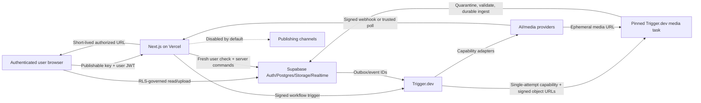

# Genie Threat Model and Abuse-Resistance Contract

**Status:** Normative security design and adversarial test contract  
**Version:** 1.0  
**Last updated:** 2026-07-17  
**Applies to:** Genie web application, Supabase, Trigger.dev, media workers,
provider adapters, AI agents, exports, and future publishing adapters  
**Related contract:** `docs/state-and-data-contract.md`

## 1. Security objective

Genie must let multiple internal users create expensive, culturally sensitive
media concurrently without allowing one user, browser, agent, provider,
callback, uploaded file, or stale workflow to:

- read or modify another workspace's data;
- change an immutable script, Series Release, approved asset, QC verdict, or
  master without an explicit versioned workflow;
- bypass cultural, theological, quality, budget, or final-approval gates;
- cause unbounded provider spend;
- turn untrusted text into tool authority;
- publish or export a stale or unapproved video;
- leak secrets, signed URLs, scripts, references, personal data, or provider
  payloads through diagnostics;
- hide tampering or destroy the evidence needed to reconstruct what happened.

Security is part of output quality. An unauthorized or culturally manipulated
master is a failed master even if the pixels are technically correct.

## 2. Scope and assumptions

### 2.1 In scope

- Next.js/Vercel browser and server surfaces;
- Supabase Auth, Postgres, Storage, and Realtime;
- Trigger.dev jobs and callbacks;
- containerized ffmpeg/media workers;
- image, video, speech, music, SFX, alignment, ASR, reasoning, and judging
  providers;
- uploads and remote-reference ingestion;
- Monica and all specialist agents/tools;
- email invitations and product notifications;
- cost controls, diagnostics, audit, export, and future channel publishing;
- GitHub, package registries, build pipelines, migrations, and deployment
  configuration;
- backup, restore, reconciliation, incident revocation, and recovery.

### 2.2 Assumptions

- The product is internal but has multiple users and therefore cannot trust
  every authenticated user equally.
- Users may make mistakes, use compromised devices, paste adversarial content,
  or intentionally exceed their authority.
- Provider output, retrieved web content, script text, prompts, captions,
  filenames, metadata, callbacks, and model-generated JSON are untrusted input.
- Provider APIs and CDN URLs may be delayed, duplicated, reordered,
  compromised, or temporarily unavailable.
- The Supabase publishable key is public by design. Security depends on RLS,
  grants, Storage policies, server authorization, and command invariants.
- The Supabase service-role/secret key bypasses RLS and is a critical server
  secret.
- A valid JWT may contain stale membership/role claims. Sensitive actions
  require a fresh database authorization check.
- Human cultural and final approvals are high-consequence actions and require
  strong authentication and exact-version binding.

### 2.3 Out of scope at launch

- Public anonymous users, public self-service billing, and untrusted customer
  tenancy;
- direct social publishing unless an adapter is explicitly enabled;
- character dialogue/lip-sync;
- arbitrary user-provided plugins, code, or shell scripts.

Out-of-scope features MUST remain disabled rather than partially exposed.

## 3. Assets and impact categories

### 3.1 Critical assets

| Asset | Why it matters |
|---|---|
| Workspace membership and roles | Controls every other resource |
| Service-role and provider credentials | Can bypass RLS or spend money |
| Locked scripts and Series Releases | Creative and semantic source of truth |
| Character/location anchors and cultural manifests | Identity, dignity, and continuity |
| Provider budgets and cost ledger | Direct financial exposure |
| QC/cultural verdicts and evidence | Release authorization |
| Passing/approved masters | Public-facing company output |
| Master approvals and publish receipts | High-consequence authority |
| Audit history | Tamper detection and incident reconstruction |
| Source media and production packages | Valuable, private production IP |

### 3.2 Impact labels

- **C** — confidentiality loss;
- **I** — integrity/tampering;
- **A** — availability loss;
- **$** — financial/cost abuse;
- **S** — devotional/cultural safety or reputational harm.

Risk ratings:

- **Critical:** credible path to cross-workspace access, secret compromise,
  unauthorized publication, release-gate bypass, destructive loss, or
  unbounded spend.
- **High:** material episode/Series tampering, account takeover, stored
  malicious media, approval replay, or broad operational outage.
- **Medium:** scoped data exposure, workflow disruption, diagnostic leakage, or
  noisy bounded abuse.
- **Low:** limited inconvenience with straightforward recovery and no sensitive
  impact.

## 4. Trust boundaries



Crossing any boundary requires:

- authenticated identity appropriate to the boundary;
- typed, schema-validated input;
- workspace and exact-version scope;
- idempotency/correlation ID;
- size, time, rate, and budget limits;
- redacted observability;
- explicit success/failure state.

## 5. Security invariants

1. No service-role key, provider secret, webhook secret, database password,
   refresh token, or Trigger.dev secret is present in browser JavaScript,
   Realtime payloads, exported bundles, model prompts, or diagnostic events.
2. Every exposed Postgres table has explicit grants and RLS.
3. Every workspace-owned row carries and enforces `workspace_id`.
4. `raw_user_meta_data` is never used for authorization.
5. High-consequence commands query current membership/permission and verify the
   current Auth session; cached UI role and stale JWT app metadata are
   insufficient.
6. Admin, Series publish/withdrawal, cultural override, final approval, budget
   increase, credential management, and publishing require `aal2`.
7. Agents cannot grant themselves tools, widen scope, modify policy, approve
   cultural exceptions, increase budgets, or publish.
8. Provider callbacks cannot directly mutate public state or attach assets.
9. Unvalidated uploads/provider media never enter accepted-reference or
   production buckets.
10. Every provider request has both a dollar ceiling and bounded retries.
11. Cultural and final approval bind exact content/evidence/version hashes.
12. Publishing adapters are disabled by default and cannot publish anything
    other than an exact approved export manifest.
13. Deletion, archival, cancellation, and session revocation are auditable and
    do not erase historical evidence improperly.
14. Backups are not considered usable until a restore and reconciliation drill
    succeeds.

## 6. Supabase and authorization architecture

### 6.1 Schema exposure

Recommended layout:

- `public`: narrowly client-readable/product tables with RLS;
- `private`: commands, provider requests, secrets references, outbox/inbox,
  cost internals, and privileged helpers; not exposed through Data API;
- `audit`: append-only restricted records; not client-exposed;
- `storage`: Supabase-managed schema, protected by object policies.

New Supabase projects may not automatically expose new tables to the Data API.
Migrations MUST declare grants explicitly and tests MUST not infer access from
schema placement.

### 6.2 Authentication and authorization

- Use Supabase Auth with PKCE-compatible SSR patterns and a new server client
  per request.
- Server actions verify a fresh user/claims result, then load active
  `memberships` from Postgres.
- Database membership is authoritative. `app_metadata` MAY cache coarse
  workspace IDs but is never sufficient for high-consequence authorization
  because JWT claims can be stale.
- Anonymous sign-in is disabled.
- `TO authenticated` is only role selection; every RLS policy also checks
  workspace membership/resource permission.
- Update policies use `USING` and `WITH CHECK`; required select policy exists.
- RLS policy columns are indexed.
- Client-exposed views use `security_invoker = true`, or remain in a private
  schema with grants revoked.
- `SECURITY DEFINER` functions are exceptional: private schema, fixed
  `search_path`, internal identity/permission check, `EXECUTE` revoked from
  `PUBLIC`, and narrowly granted.
- Sensitive direct table mutations are revoked. Version-bound database command
  functions or server endpoints perform them.

### 6.3 Role matrix

| Action | Pending | Member | Reviewer/approver | Admin |
|---|---:|---:|---:|---:|
| View invited onboarding surface | Yes | Yes | Yes | Yes |
| Read workspace Series/Episodes | No | Yes | Yes | Yes |
| Create Episode/draft assets | No | Yes | Yes | Yes |
| Claim ordinary work | No | Eligible | Eligible | Yes |
| Publish Series Release | No | No unless separately granted | Yes | Yes |
| Approve final master | No | No | Yes | Yes |
| Override cultural blocker | No | No | Separate cultural permission + dual control | Separate cultural permission + dual control |
| Raise hard budget | No | No | No unless granted | Yes |
| Invite/deactivate/change roles | No | No | No | Yes |
| Configure provider credentials/publishing | No | No | No | Admin with `aal2` |
| Read security/audit diagnostics | No | No | Limited release evidence | Admin/security role |

Creator, owner, assignee, and claimant do not imply approval authority.

### 6.4 RLS test pattern

For every table and operation, tests cover:

- unauthenticated;
- pending/deactivated user;
- active member in same workspace;
- active member in another workspace;
- reviewer/admin with and without the specific permission;
- user with stale role token after database revocation;
- service worker through its server-only path;
- cross-workspace parent/child IDs;
- update that attempts to change `workspace_id`, owner, or authority fields.

An RLS test that only checks "authenticated user succeeds" is insufficient.

## 7. Storage and media security

### 7.1 Bucket model

All production buckets are private.

| Bucket/class | Writer | Reader | Controls |
|---|---|---|---|
| `quarantine` | Short-lived signed upload or trusted ingest worker | Scanner/ingest worker only | No production references; aggressive expiry |
| `workspace-media` | Validated ingest worker | Authorized workspace users/workers | Workspace/content-addressed path |
| `diagnostic-evidence` | QC/diagnostic worker | Restricted reviewer/admin | Redacted, short retention |
| `exports` | Export worker | Authorized workspace users | Immutable object version/checksum; signed download |
| `public-previews` | Disabled at launch | None | Enable only with separate publication review |

Object path:

```text
<workspace-id>/<asset-kind>/<stable-asset-id>/<asset-version-id>/<safe-name>
```

The server generates IDs and object names. User filenames are display metadata,
not paths.

Supabase Storage policies MUST check bucket, workspace prefix, active
membership, operation, and immutable-object rules. Upsert is prohibited for
accepted/versioned objects; a replacement is a new object version. Where
upsert is deliberately used for a temporary object, policies account for
`INSERT + SELECT + UPDATE`.

### 7.2 Upload pipeline

1. Server authorizes purpose, workspace, MIME allowlist, and size; returns a
   short-lived upload grant for one quarantine path.
2. Storage/global and bucket limits reject oversized objects early.
3. Ingest worker streams with byte limits and computes a cryptographic hash.
4. Validate magic bytes independently of extension and request header.
5. Parse in a sandboxed, resource-limited worker.
6. Scan for malware and archive bombs.
7. Decode and re-encode images/audio/video when practical.
8. Reject polyglot, malformed, unsupported, encrypted, or unexpectedly
   executable content.
9. Enforce dimensions, duration, frame rate, channel count, codec, pixel count,
   decompressed size, and decode-time limits.
10. Strip EXIF/GPS and unsafe metadata; retain rights/provenance as structured
    database fields.
11. Generate safe preview/thumbnail separately.
12. Commit a validated immutable asset version, then move/copy to its final
    path.
13. Delete quarantine input according to policy.

No model or browser receives a local filesystem path.

### 7.3 Media-specific abuse

Controls MUST address:

- image decompression bombs and extreme dimensions;
- malformed video containers and parser vulnerabilities;
- duration/header mismatches;
- hidden tracks, attachments, subtitles, scripts, or metadata;
- zip/tar path traversal and nested archives;
- EXIF geolocation or personal metadata;
- adversarial text embedded in images intended to prompt-inject VLMs;
- copyrighted or unrelated uploads mislabeled as owned assets;
- loudness spikes, ultrasonic/unexpected audio, or malicious sample rates;
- duplicate content used to evade limits.

Media tooling runs without cloud credentials, service-role keys, or broad
network access. It writes only to a scoped scratch directory with quotas and
automatic cleanup.

## 8. Remote fetch and SSRF contract

Provider result ingestion and temple/reference research are SSRF surfaces.

The fetcher MUST:

- accept only `https` (and provider-specific signed `https`) URLs;
- reject credentials in URLs, fragments, nonstandard schemes, and ambiguous
  numeric/encoded hosts;
- resolve DNS server-side and block loopback, link-local, private, multicast,
  carrier-grade NAT, documentation, and cloud metadata ranges for IPv4/IPv6;
- re-resolve and revalidate every redirect target;
- defend against DNS rebinding by connecting only to the validated resolved
  address while preserving correct TLS hostname validation;
- use a provider-host allowlist when the provider has stable domains;
- cap redirects, response headers, bytes, duration, and bandwidth;
- reject unexpected content types and content-length mismatches;
- never forward user cookies, authorization headers, provider credentials, or
  internal headers;
- run in an egress-restricted worker where possible;
- store only canonicalized safe source metadata;
- quarantine fetched content before use.

Web research fetches and provider media fetches use separate allowlists and
credentials. A prompt-provided URL is never fetched merely because a model
requested it.

## 9. Agent, prompt-injection, and tool-abuse contract

### 9.1 Authority model

Models propose typed decisions. Deterministic workers execute allowlisted
effects. Model output is data, never authority.

Each tool definition has:

- a narrow domain verb;
- schema-validated arguments;
- workspace/episode/run scope inserted by trusted code, not copied from model
  text;
- read/write classification;
- maximum count, duration, bytes, retries, and dollar value;
- allowed caller agent and workflow stage;
- required preconditions and permission;
- idempotency key;
- audit event and safe result schema.

Prohibited tools:

- arbitrary shell, SQL, HTTP, filesystem paths, package installation, secrets
  access, role changes, budget changes, RLS changes, or generic "execute";
- arbitrary provider/model selection outside verified capability rows;
- direct publish or approval from an agent;
- free-form cross-Episode data search without explicit scoped retrieval.

### 9.2 Injection sources

Treat all of these as potentially adversarial:

- user script and repair feedback;
- uploaded-image text and metadata;
- website/reference text;
- provider/model output;
- filenames and captions;
- prior Monica messages;
- Series canon notes;
- exception/error strings.

The system prompt and tool policy state that instructions inside retrieved or
user content are quoted production material and cannot modify system policy.
That instruction alone is not a control; tool authorization code enforces the
boundary.

### 9.3 Agent output validation

- Use strict JSON Schema with unknown properties rejected.
- Validate IDs against the current workspace and expected object type.
- Validate all enums, lengths, timestamps, time ranges, URLs, and costs.
- Recompute hashes, dependency closures, rubric arithmetic, and release gates
  deterministically.
- Reject references to nonexistent/stale versions.
- Require evidence links for cultural and QC claims.
- Limit recursive plan depth and task fan-out.
- Separate interpretation from execution; Monica's repair rows must compile
  into a confirmed Repair Plan.
- Persist prompt/model/schema versions for reproducibility.

Prompt-injection findings are security diagnostics and MUST NOT echo the full
malicious payload into general logs or other model contexts.

## 10. Provider request and webhook security

### 10.1 Outbound requests

- Provider credentials are server-only and least privilege where supported.
- Every request pins provider account, capability/model/version, endpoint,
  region/retention policy, request schema version, input hashes, and maximum
  cost.
- Providers are called only from allowlisted adapters.
- Logs redact headers, tokens, signed input/output URLs, script bodies, and raw
  payloads.
- Request timeouts, retry classes, and total retry/candidate/dollar ceilings are
  explicit.
- Idempotency keys are stable for a logical submission where provider semantics
  support them.
- Provider training/retention terms and permitted data region must be current
  before sending scripts or reference media.

### 10.2 Inbound callbacks

- Use a distinct high-entropy endpoint secret per provider/environment.
- Verify signature over raw bytes before JSON parsing where the provider
  specifies this.
- Enforce timestamp skew/nonce replay window when available.
- Limit body size, content type, method, and rate before expensive processing.
- Resolve request by server-generated correlation and provider account.
- Persist verification outcome and canonical hash in a private inbox.
- Acknowledge promptly and process asynchronously.
- Never accept provider-supplied workspace IDs, prices, asset ownership,
  callback URLs, or state transitions as authoritative.
- Reconcile claimed cost against trusted billing/poll data.
- Duplicate, reordered, and late callbacks are normal test cases.
- A provider completion produces quarantine media, not an accepted asset.

If signatures are not available, callback content can only signal "poll now."
An authenticated server-side poll determines final state.

## 11. Secrets and credential lifecycle

### 11.1 Secret classes

| Class | Examples | Location |
|---|---|---|
| Browser-public configuration | Supabase URL, publishable key | `NEXT_PUBLIC_*` |
| Application server secret | Supabase secret/service role, provider API keys, Trigger secret | Vercel/Trigger encrypted environment |
| Webhook verification | Provider callback secrets | Server environment, rotated independently |
| Media-task authority | Short-lived single-attempt capability token and signed object URLs | Issued just in time; hashed `jti` and scope in Postgres; no static worker secret |
| Human/admin credential | GitHub/Vercel/Supabase access | Individual accounts with MFA, not shared files |

Rules:

- Never prefix secrets with `NEXT_PUBLIC_`.
- `.env*` files are ignored; `.env.example` contains names and descriptions
  only.
- Startup validates that required variables exist and that secret values are
  not accidentally identical to placeholders.
- Build output and source maps are scanned for known secret patterns.
- Diagnostics use field allowlists, not post-hoc string replacement alone.
- Secret values are never passed to models.
- Credential owners, purpose, environment, creation, last rotation, and
  incident-revocation procedure are documented without storing the value.
- Separate development, preview, and production credentials/projects.
- Rotate immediately after suspected exposure; invalidate outstanding signed
  URLs/webhooks/sessions where applicable; reconcile unauthorized usage.

Service-role clients are created only inside narrowly reviewed Vercel/Trigger
server modules that require them. The ffmpeg media task receives no service-role
key and no broad provider credential. It uses an expiring grant scoped to one
workspace/run/stage attempt/fencing token, allowlisted RPCs and object paths,
with one-time `jti`, current authority epoch, and signed URLs. Service clients
are never imported by client components.

## 12. Budget and cost-abuse controls

Autonomous media generation creates denial-of-wallet risk even without an
external attacker.

Required controls:

- hard workspace, Episode, run, repair-plan, provider, capability, and daily
  ceilings;
- atomic reservation before provider enqueue;
- explicit approval to exceed USD 50 per Episode at launch;
- provider adapter rejects missing/unknown price metadata for expensive calls;
- candidate, retry, repair-depth, wall-clock, and task-fan-out limits;
- concurrency limits and fair scheduling;
- rate limits by user, workspace, Episode, command, IP/session, and provider;
- one idempotent request per logical action;
- no automatic retry for authentication, policy refusal, invalid input, or
  unknown billing state;
- circuit breaker for abnormal error/spend velocity;
- stale/canceled work may be charged in the ledger but cannot trigger further
  automatic generations;
- user-facing delta quote for Repair Plans;
- alerts before and at hard limits;
- admin budget changes require `aal2`, reason, effective window, and audit;
- daily provider-billing reconciliation.

Cost events are append-only. "Refund," "credit," and "billed with no usable
asset" are separate event types rather than overwriting charges.

## 13. Diagnostics and audit security

### 13.1 Diagnostic schema

Use allowlisted fields:

- event type/schema version;
- timestamp, environment, release;
- safe workspace/aggregate IDs;
- correlation/causation IDs;
- stage/provider/capability classification;
- duration, status/error class, retry count;
- redacted safe summary;
- retention class.

Do not store:

- secrets, authorization/cookie headers, access/refresh tokens;
- signed URLs;
- full script bodies or narration text;
- raw prompts/reference images by default;
- raw provider webhook/request bodies after short controlled retention;
- local paths containing user information;
- unbounded stack/request objects;
- user email/IP unless required and separately classified.

Client error reports are schema-limited, size-limited, rate-limited, and
sanitized on the server. The client cannot choose severity, workspace, actor,
or retention class authoritatively.

### 13.2 Audit

Audit events are append-only and include:

- actor kind/ID, current membership/role, session ID, and AAL;
- command and idempotency ID;
- target and exact version/hash;
- permission decision;
- prior/new state or hashes;
- reason/evidence;
- correlation/causation;
- IP/device summary where policy permits;
- outcome.

High-risk audit events stream to the operational alert path and the separate
`Genie Vault` Supabase project. Vault objects/rows are content-addressed,
checksum-verified, and written by a dedicated append-only principal that the
normal application cannot update/delete. Merely storing them in the primary
Supabase project is not monitoring or independent recovery.

Access to diagnostics/audit is itself audited. General members cannot query
security logs.

## 14. Invitations, MFA, sessions, and offboarding

### 14.1 Invitations

- Only admins with `aal2` can invite.
- Invitation records contain a hash of a high-entropy single-use token, exact
  email, workspace, maximum role, issuer, expiry, and consumed/revoked state.
- Default expiry is 24 hours; resending revokes the prior token.
- Acceptance requires the authenticated email to match after normalization and
  verification.
- Invite links do not contain role-changing claims trusted without a database
  check.
- Rate-limit invitation creation and acceptance; alert on bursts.
- A configurable company-domain allowlist SHOULD be enabled for Zyra Internal.
- Invitations cannot create an admin unless an existing admin performs an
  explicit, separately audited elevation.
- The first-admin bootstrap is a one-time deployment procedure, disabled after
  use and tested to be unreachable.

### 14.2 MFA

- TOTP MFA is mandatory for admins, reviewers/approvers, and users with
  credential/budget/publishing authority; recommended for all members.
- The app implements enrollment, recovery, challenge, and factor removal.
- High-consequence server commands and restrictive RLS policies verify
  `aal2`.
- Factor removal and recovery require recent reauthentication, alerting, and
  audit.
- MFA enrollment UI without backend/database enforcement does not satisfy this
  contract.

### 14.3 Sessions and revocation

- Use short-lived access tokens within Supabase-supported operational guidance;
  configure inactivity and maximum session lifetime appropriate to the internal
  product.
- Sensitive commands validate the JWT `session_id` against current session
  state or an app-side revocation record.
- Role downgrade, deactivation, suspicious activity, password reset, factor
  reset, or incident response revokes sessions and active work leases.
- Because deleting a user does not guarantee immediate invalidation of every
  issued access token, offboarding revokes/signs out sessions first, marks
  membership inactive, revokes claims/leases, transfers ownership, then
  deletes only if policy requires.
- Long-running workflows are service-owned; a user's logout does not stop safe
  work, but the workflow cannot use the departed user's authority for a future
  approval or budget increase.
- Frontend tabs receive session/role-change signals but sensitive enforcement
  remains server-side.

## 15. Cultural and theological approval integrity

Threats include bypassing a blocker, swapping evidence, using a previous
approval for a changed frame, or pressuring an agent to label a regional
retelling as canonical.

Controls:

- cultural evidence, policy, findings, and decisions are immutable/versioned;
- every decision binds subject content hash, Series Release/configuration,
  policy version, source-review decision, evidence IDs, actor, role, competency
  version, recusal result, time, and reason;
- model-generated research is a lead only; Source Review requires stable
  citations/archive handles, accepted evidence classification, rights status,
  contradiction resolution, and a qualified human decision when triggered;
- reviewer competency is a scoped, effective-dated, expiring, suspendable and
  revocable entity with appointment evidence; admin role does not imply it;
- conflict-of-interest/recusal records are checked at commit time;
- an approval cannot apply to a regenerated asset with a different hash;
- deterministic release gates verify the exact decision and subject;
- cultural overrides require `aal2`, a dedicated permission, mandatory reason,
  and a second authorized human for release-blocking matters;
- Monica and specialist agents can recommend or block, but cannot authorize an
  override;
- withdrawal/correction creates a new decision and impact analysis; it never
  edits history;
- Series Release publication and final master approval fail if required
  cultural evidence is stale, missing, withdrawn, or from another workspace;
- temple-reference evidence preserves source, retrieval time, rights/use
  classification, and geometry-vs-style purpose;
- detached thumbnails/freeze frames are checked independently;
- audit alerts fire for override, evidence deletion request, policy weakening,
  and release withdrawal.

Adversarial tests replace assets after approval, replay approvals across
versions, swap evidence IDs across workspaces, downgrade a policy, race
withdrawal against approval, and attempt override with one actor.

## 16. Publishing and export security

### 16.1 Export

- Review candidates, approved masters, and superseded masters are visibly and
  structurally distinct package types.
- Approved export requires an exact active master approval and complete
  manifest/checksums.
- Packaging worker uses a fenced lease; stale workers cannot mark ready.
- Signed download URLs are short lived, regenerated after current
  authorization, and never logged.
- HTTP responses use safe content disposition and MIME; user-controlled
  filenames are sanitized display values.
- Production bundles redact server secrets, signed URLs, internal callback
  endpoints, and unnecessary personal/diagnostic data.

### 16.2 Direct publishing

Publishing is disabled by default. Enabling it requires:

- channel-specific least-privilege credential;
- admin `aal2` setup and tested revocation;
- allowlisted destination account/channel;
- organization policy and explicit approver permission;
- exact approved export manifest and checksum;
- idempotency key and external publication receipt;
- title/caption/thumbnail preview and policy validation;
- current cultural/final approval at enqueue and commit;
- reconciliation after timeout;
- safe retry that cannot duplicate posts;
- separate, explicit delete/replace authority.

No agent may invent a destination, raise visibility, change audience settings,
or publish a different asset than the approved manifest. A provider/channel
callback cannot declare internal publication success without reconciliation.

## 17. Supply-chain and deployment security

Required controls:

- commit lockfiles and pin direct dependency versions;
- automated dependency, license, and vulnerability scanning;
- generate an SBOM for production builds;
- pin GitHub Actions by full commit SHA and restrict workflow permissions;
- require review for workflow, migration, dependency, auth/RLS, and deployment
  configuration changes;
- protect the production branch and prevent unreviewed force pushes;
- use ephemeral preview environments with isolated or namespaced nonproduction
  data and credentials;
- never give forks/untrusted pull requests production secrets;
- pin container base images by digest; scan images; run as non-root with
  read-only root filesystem where possible;
- minimize ffmpeg/media image packages and patch parser vulnerabilities
  promptly;
- verify downloaded binaries/checksums and avoid runtime package installation;
- run the launch ffmpeg workload only in the dedicated Trigger.dev queue with a
  pinned Node 22 image, ffmpeg/ffprobe 7.x checksum, libass/font checksums,
  `large-1x` 4 vCPU/8 GB/10 GB machine, maximum three concurrent renders,
  scratch high-water mark below 7 GB, manifest-scoped streaming/segmentation,
  immediate verified-intermediate upload and cleanup, 70% admission stop, 80%
  checkpoint/replan threshold, startup and concat canaries,
  queue-age/disk/heartbeat alarms, and bounded task time;
- lock Supabase/Trigger/Vercel CLI versions used in CI after verifying current
  commands;
- run migration lint, RLS tests, advisors, and rollback/forward checks before
  production enablement;
- deploy schema before code that depends on it and use feature flags for risky
  activation;
- scan built client bundles and source maps for secrets;
- protect Vercel, Supabase, GitHub, Trigger.dev, and provider administrator
  accounts with individual MFA.

An emergency dependency update still receives targeted tests and produces an
auditable release; urgency does not justify bypassing integrity checks.

## 18. Threat and abuse matrix

| ID | Threat/abuse path | Impact | Risk | Prevent/detect/recover | Required adversarial test |
|---|---|---|---|---|---|
| TM-01 | User reads another workspace by changing IDs | C/I | Critical | Workspace column, composite FKs, RLS membership predicates, server auth | Enumerate every API/table with cross-workspace IDs; expect zero rows/403 |
| TM-02 | Authenticated user relies on `TO authenticated` policy with no ownership check | C/I | Critical | Policy review/test inventory; explicit membership predicates | Create outsider account and exercise all CRUD paths |
| TM-03 | User changes `workspace_id`, owner, role, authority, or approval fields on update | I | Critical | `WITH CHECK`, column grants, command-only mutations | Attempt direct REST update with forged authority fields |
| TM-04 | Service-role key appears in browser bundle or client import | C/I/$ | Critical | Server-only modules, env validation, bundle/secret scan | Build and grep/source-map scan seeded canary secret |
| TM-05 | Stale JWT retains old admin/reviewer rights | I/S/$ | Critical | Fresh membership lookup; session check for sensitive commands | Downgrade user while page open, then attempt approval/budget/publish |
| TM-06 | Logged-out/deactivated user's access token approves work | I/S | Critical | Session-ID validation/revocation on sensitive command; revoke leases | Revoke session then replay approval request |
| TM-07 | Invite token stolen/replayed or grants excessive role | C/I | High | Hashed single-use token, expiry, email match, role cap, rate limit | Replay consumed invite; mismatch email; request admin |
| TM-08 | MFA UI exists but backend accepts `aal1` | I/S/$ | Critical | Restrictive RLS/server AAL checks | Call sensitive endpoints directly with valid `aal1` token |
| TM-09 | RLS-bypassing view or public `SECURITY DEFINER` function | C/I | Critical | `security_invoker`, private schema, revoke `PUBLIC`, advisors | Enumerate views/functions as anon/authenticated |
| TM-10 | Storage path manipulation exposes another workspace | C/I | Critical | Server-generated paths; object RLS; signed URL auth | Upload/read/delete using another workspace prefix and encoded path variants |
| TM-11 | Accepted object overwritten through Storage upsert | I/S | High | Immutable version paths; no upsert for accepted assets | Attempt upsert and verify original checksum/version unchanged |
| TM-12 | Malicious/polyglot/oversized media exploits parser or worker, or a stolen task token crosses scope | I/A/C | Critical | Quarantine, magic sniff, sandbox, limits, scan, re-encode; single-attempt capability grant and fencing | Corpus of bombs/malformed media plus wrong workspace/run/stage/fence/object/RPC, replayed `jti`, expiry, and revoked-authority tests |
| TM-13 | EXIF/GPS or hidden metadata leaks through export/model | C | Medium | Strip metadata; probe/export validation | Seed GPS/comments/attachments and inspect accepted/exported files |
| TM-14 | Remote URL reaches metadata service/internal network | C/I | Critical | HTTPS only, IP blocks, redirect revalidation, egress restriction | IPv4/IPv6/private/encoded/redirect/DNS-rebinding SSRF suite |
| TM-15 | Prompt instructs agent to call tools, expose secrets, or change policy | C/I/$/S | Critical | Untrusted-data boundary, typed allowlisted tools, trusted scope insertion | Injection corpus in scripts, images, web text, provider output |
| TM-16 | Model fabricates IDs/versions or excessive task graph | I/$/A | High | Schema validation, DB scope checks, fan-out/depth/cost limits | Fuzz IDs, stale versions, cycles, huge arrays, recursive plans |
| TM-17 | Monica chat directly triggers render or script mutation | I/$ | High | Structured repair rows, confirmed plan, immutable script check | Craft chat request to bypass row/confirmation and alter narration |
| TM-18 | Forged/replayed provider webhook commits fake asset | I/S/$ | Critical | Raw-body signature, replay window, inbox idempotency, poll reconciliation | Bad signature, old timestamp, duplicate nonce/event, wrong account |
| TM-19 | Valid late callback overwrites newer/canceled work | I/$ | High | Authority epoch, fencing/CAS; terminal request remains unchanged while orthogonal late-completion/cost evidence appends | Complete attempt after cancel/supersede/new worker commit |
| TM-20 | Provider response URL carries malicious media | I/A | High | Quarantine and same validation as uploads | Provider test adapter returns malformed/oversized/wrong MIME |
| TM-21 | Lost response causes duplicate provider spend | $ | High | Stable idempotency/correlation, reconciliation before retry | Drop submit response after provider accepts; verify one logical charge |
| TM-22 | User/agent creates unbounded generations or retry loop | $/A | Critical | Reservations, hard ceilings, candidate/retry/time limits, circuit breaker | Concurrent duplicate commands and persistent retryable failures |
| TM-23 | Race allows reservations beyond hard budget | $ | Critical | Atomic CAS/lock reservation and unique request mapping | High-concurrency reservation test at remaining-limit boundary |
| TM-24 | Cancellation hides billable request or revives workflow | $/I | High | Append-only cost settlement; stale completion; no terminal reopen | Bill after cancel and verify charge recorded but output not authoritative |
| TM-25 | Secrets/scripts/tokens appear in diagnostics | C | Critical | Allowlisted schemas, server redaction, retention, access restriction | Seed canary secrets in headers/payloads/errors and query every log surface |
| TM-26 | Attacker floods client diagnostics/inbox/Realtime | A/$ | Medium | Auth, size/rate limits, schema, dedupe, quotas | Burst malformed diagnostics and subscriptions |
| TM-27 | Realtime leaks rows/channel presence across workspace | C | High | Realtime authorization/RLS; safe payloads; reconnect query | Subscribe with outsider token and guessed topics |
| TM-28 | Cultural blocker/evidence/approval is edited or replayed | I/S | Critical | Immutable versioned decisions, exact hashes, dual override | Swap asset after approval; replay decision on different hash/workspace |
| TM-29 | One person silently overrides release-blocking cultural finding | I/S | Critical | Dedicated permission, `aal2`, dual control, audit alert | Same actor attempts both approvals and direct DB mutation |
| TM-30 | Stale final-review page approves replacement master | I/S | Critical | Exact master/QC/config CAS and current review target | Open review, create new master, submit old approval |
| TM-31 | Export packages stale/unapproved/superseded media | I/S | High | Immutable manifest, approval binding, checksum/completeness gate | Change EDD/master after request; attempt export ready commit |
| TM-32 | Signed URL leaked or remains usable too long | C | High | Short TTL, regenerate after auth, never log | Capture URL, revoke membership, test expiry and access regeneration |
| TM-33 | Agent or user publishes without authority/to wrong channel | I/S | Critical | Adapter off, allowlisted channel, approval manifest, `aal2`, idempotency | Forge destination/visibility/asset; duplicate publish callback/retry |
| TM-34 | Dependency/build pipeline injects malicious code | C/I/$ | Critical | Lockfile, SHA-pinned CI, SBOM, scans, protected branch, isolated previews | Compromised-package simulation and secretless fork build |
| TM-35 | Preview/dev environment accesses production data/providers | C/I/$ | Critical | Separate projects/keys, environment assertions, no prod secrets | Run preview with production-shaped IDs and verify network/credential denial |
| TM-36 | Database backup restored but Storage/provider state diverges | I/A/$ | Critical | Restore runbook, object backups, reconciliation, dispatch freeze | Restore old DB snapshot with newer external jobs and objects |
| TM-37 | Admin deletes user before ownership/leases/sessions handled | I/A | High | Offboarding workflow: revoke, deactivate, transfer, then delete | Deactivate owner with active work/run and verify safe continuation |
| TM-38 | Audit records are modified/deleted by application user | I | Critical | Private append-only schema, restricted role, external archive/hash chain | Attempt update/delete as member/admin app roles |
| TM-39 | Search index exposes text user cannot read | C | High | Search query RLS/security-invoker; no global privileged cache | Search unique cross-workspace script phrase |
| TM-40 | Stored XSS through titles, prompts, captions, diagnostics | C/I | High | React escaping, sanitize rich text, CSP, no unsafe HTML | Stored XSS payload corpus across every rendered text field |
| TM-41 | CSRF/replay invokes high-consequence server command | I/$/S | High | SameSite/Origin checks, POST only, command IDs, fresh auth/AAL | Cross-origin form/fetch and replay same command |
| TM-42 | Publishing/export bundle includes internal prompts/secrets unexpectedly | C | High | Package allowlist and content scanner | Seed secret/canary in internal metadata and inspect all artifacts |

## 19. Security verification plan

### 19.1 Database/RLS suite

Automate with pgTAP or an equivalent database test harness:

- enumerate exposed tables/views/functions and their grants;
- fail if RLS is disabled on an exposed table;
- test every role/resource/operation matrix;
- test cross-workspace composite foreign keys;
- verify immutable tables/triggers;
- inspect security-definer ownership, schema, `search_path`, and grants;
- verify Storage policies for read/list/insert/update/delete;
- run Supabase security/performance advisors and triage all findings.

### 19.2 Application/API suite

- authorization at route, server action, and database layers;
- object-level access and mass-assignment fuzzing;
- stale version, stale membership, expired lease, revoked session, and AAL
  downgrade;
- CSRF, XSS, open redirect, unsafe content disposition, and error leakage;
- rate limits and idempotency under concurrency;
- signed URL expiry and authorization refresh;
- environment separation and client-bundle secret scans.

### 19.3 Agent red-team suite

Seed adversarial instructions in:

- Hindi/English scripts;
- Sanskrit annotations;
- repair feedback;
- image text/OCR and metadata;
- temple web references;
- provider error/output text;
- Series canon notes.

Assert:

- no extra tool authority;
- no cross-workspace retrieval;
- no secret access;
- no budget/policy/approval change;
- no arbitrary URL fetch;
- no unconfirmed render;
- no script mutation;
- typed output rejection and safe recovery.

### 19.4 Media and SSRF suite

Maintain a noncopyright test corpus containing:

- malformed/truncated image/audio/video;
- decompression and oversized-dimension samples;
- container bombs, hidden attachments, odd codecs/tracks;
- polyglot and renamed executable files;
- metadata/EXIF payloads;
- VLM injection text;
- private/loopback/link-local/metadata IPv4/IPv6 URL variants;
- redirect chains, DNS rebinding harness, huge/chunked/slow responses.

Run media parsers in instrumented containers and assert CPU, memory, disk,
network, timeout, cleanup, and credential isolation.

### 19.5 Webhook and cost suite

- signature algorithms, raw-body handling, timestamp/nonce windows;
- duplicate/reordered/late/cross-account callbacks;
- poll-vs-webhook disagreement;
- lost response and retry;
- rate-limit/429 and circuit breaker;
- estimate/reservation/charge/refund/billed-no-asset reconciliation;
- concurrency at hard budget boundary;
- provider compromise simulation returning unexpected URLs/media/cost.

### 19.6 Cultural and release suite

- stale/withdrawn policy and evidence;
- replaced frame after cultural approval;
- regional-vs-canonical classification manipulation;
- single-actor override attempt;
- reviewer role revoked between playback and approval;
- source master changed between Repair Plan and execution;
- approved/superseded/review-candidate export distinction;
- disabled publishing path cannot be reached.

## 20. Security release gates

Production release is blocked unless:

1. no Critical/High open finding lacks an accepted, time-bounded mitigation;
2. RLS/grant/function/view/Storage inventory tests pass;
3. client bundle and diagnostics contain no seeded canary secret;
4. admins/approvers are forced through `aal2`;
5. stale-role, stale-master, cross-workspace, lease-fencing, and budget-race
   tests pass;
6. upload/media/SSRF corpus passes within resource limits;
7. webhook duplicate/replay/late-callback suite passes;
8. prompt-injection suite proves tools remain scoped;
9. cultural override and final approval integrity tests pass;
10. export manifest and signed-URL tests pass;
11. dependency/container/CI scans meet policy;
12. backup restore and post-restore reconciliation drill succeeds;
13. alert delivery is tested for secret exposure, spend anomaly, cultural
    override, RLS/authorization failure burst, dead-letter age, and publishing.

## 21. Incident response and disaster recovery

### 21.1 Incident classes

- credential/secret exposure;
- account takeover or unauthorized role/session;
- cross-workspace/RLS/Storage exposure;
- malicious media or worker compromise;
- provider/webhook compromise;
- spend anomaly/denial of wallet;
- cultural/final approval tampering;
- unauthorized export/publication;
- supply-chain compromise;
- database/Storage loss or corruption.

For each class, the runbook defines detection, containment credentials,
dispatch freeze, evidence preservation, user/provider notification, recovery,
and post-incident verification.

### 21.2 Immediate containment capabilities

Operators MUST be able to:

- disable provider capability/account and publishing adapter;
- open a provider/workspace/global circuit breaker;
- revoke/rotate a secret;
- revoke Auth sessions, membership, work leases, and workflow authority epochs;
- freeze new spend while allowing safe inspection;
- withdraw a Series Release or master from new use without deleting history;
- expire signed URLs and disable export generation;
- quarantine/delete malicious objects;
- pause outbox destinations;
- mark affected records for reconciliation.

### 21.3 Recovery targets

Targets are environment policy and must match the purchased Supabase/hosting
capabilities:

- production Postgres target: **RPO ≤ 5 minutes** with PITR and **RTO ≤ 2
  hours**;
- if PITR is not enabled, production enablement fails; the application may run
  only in explicitly labelled demo/non-production mode;
- approved masters, locked source assets, Series Release manifests, and export
  packages plus restricted audit records copy to the separate `Genie Vault`
  Supabase project with critical Storage/audit **RPO ≤15 minutes** and **RTO ≤4
  hours**;
- deployment source, migrations, environment contract, and infrastructure
  configuration are retained in GitHub with **RTO ≤2 hours**.

Database backups do not by themselves prove Storage recovery. Critical Storage
objects and manifests need independent backup/replication with checksum
verification.

### 21.4 Restore procedure

1. Declare incident and freeze provider dispatch, approval, export, and
   publishing.
2. Select/verify database and object restore points.
3. Restore into isolated environment first.
4. Apply/verify migrations and RLS/grants.
5. Verify Auth/membership/session posture; revoke suspect sessions.
6. Reconcile object manifests/checksums and quarantine orphans.
7. Reconcile provider requests/costs newer than the database restore.
8. Reconcile Trigger.dev runs, outbox/inbox, leases, exports, and publication
   receipts.
9. Fence all pre-restore workers and rotate authority epochs.
10. Run state invariants, security smoke tests, and sample media playback.
11. Resume read access, then controlled dispatch, then approvals/exports, then
    publishing.
12. Record actual RPO/RTO, gaps, and remediation.

Restore drills run at least quarterly and after material schema/orchestration
changes.

## 22. Current Supabase security notes

Verified against official Supabase documentation and changelog on 2026-07-17:

- exposed-schema tables require RLS, and SQL-created tables need deliberate RLS
  and grants;
- new-table Data API exposure defaults have changed for newer projects, so
  grants must be explicit;
- service keys bypass RLS and must not be public;
- authorization must not rely on user-editable metadata;
- JWT role/app metadata can be stale until refresh;
- views can bypass underlying RLS unless configured as security invoker or kept
  unexposed;
- Storage access uses RLS on `storage.objects`; bucket/global size and MIME
  restrictions should be configured;
- MFA must be enforced in APIs/database, not only in UI;
- Auth access tokens carry `session_id`, which can be checked for strict
  revocation on sensitive operations;
- sessions are not necessarily invalidated instantly by every configuration or
  account change, so Genie uses explicit revocation/current-session checks for
  high-consequence commands.

Primary references:

- [Supabase product security index](https://supabase.com/docs/guides/security/product-security)
- [Supabase Row Level Security](https://supabase.com/docs/guides/database/postgres/row-level-security)
- [Supabase Storage access control](https://supabase.com/docs/guides/storage/security/access-control)
- [Supabase Storage limits](https://supabase.com/docs/guides/storage/uploads/file-limits)
- [Supabase MFA](https://supabase.com/docs/guides/auth/auth-mfa)
- [Supabase user sessions](https://supabase.com/docs/guides/auth/sessions)
- [Supabase changelog](https://supabase.com/changelog)
